# PROMPT 09 - Document de Presentation Finale avec Diagrammes (PRESENTATION.md)

## OBJECTIF

Ce prompt definit les regles et la structure pour rediger un **document Markdown de presentation finale** du systeme de bases de donnees federees. Ce document regroupe **tous les diagrammes du projet** (cas d'utilisation, MCD, MLD, architecture, sequence, activite, deployment) et constitue le support de presentation **oral devant un jury d'examen**.

Ce document est genere **a la fin du projet** et utilise **Mermaid** pour tous les diagrammes, ce qui permet de les visualiser directement dans les outils Markdown (GitHub, GitLab, VS Code, Typora, etc.).

## PRINCIPES DIRECTEURS

1. **Mermaid obligatoire** — Tous les diagrammes sont ecrits en syntaxe Mermaid, directement integrable dans le Markdown. Aucune image externe.
2. **Coherence visuelle** — Tous les diagrammes utilisent la meme palette de couleurs et les memes conventions de nommage.
3. **Completude** — Chaque diagramme est accompagne d'un texte explicatif (minimum 150 mots) qui decrit ce qu'il represente, les choix effectues et les points d'attention.
4. **Verite de terrain** — Les diagrammes refletent l'implementation reelle, pas la conception initiale. Si une entite ou un cas d'utilisation a ete simplifie, le diagramme le montre tel quel.
5. **Presentation orale** — Le document est structure pour etre projete et presente. Chaque section correspond a une "diapositive" ou un groupe de diapositives.
6. **Langue** — Le document est en **FRANCAIS**. Les labels des diagrammes Mermaid sont en francais.

## CONVENTIONS MERMAID POUR CE PROJET

### Palette de couleurs

```mermaid
%% Palette a utiliser dans tous les diagrammes
%% PostgreSQL (hub) : #1e3a5f (bleu marine)
%% MySQL (credits) : #c8a951 (or)
%% SQL Server (compta) : #059669 (vert)
%% Frontend : #6366f1 (indigo)
%% Backend : #8b5cf6 (violet)
%% Acteur principal : #1e3a5f
%% Acteur secondaire : #6b7280 (gris)
```

### Conventions de nommage

| Element | Convention | Exemple |
|---------|-----------|---------|
| Entite MCD | PascalCase, singulier | Client, Compte, DossierCredit |
| Attribut MCD | camelCase | idClient, nom, prenom, dateNaissance |
| Association MCD | VERBE_INFINTIF | Posseder, Consulter, Gerer |
| Table MLD/MPD | snake_case, singulier | client, compte, dossier_credit |
| Colonne MLD/MPD | snake_case | id_client, nom, prenom, date_naissance |
| Acteur cas d'utilisation | Role metier | DirecteurAgence, AgentCredit, AnalysteRisque |
| Cas d'utilisation | Verbe a l'infinitif | Consulter profil client, Creer dossier de credit |

---

## STRUCTURE DU DOCUMENT PRESENTATION.md

```markdown
# Systeme de Bases de Donnees Federees
## Banque Commerciale du Togo
### Presentation du Projet

**Universite de Lome — Ecole Polytechnique — Departement d'Informatique**
**UE : DBA | Annee 2025-2026**

---

# SOMMAIRE

1. [Introduction et Problematique](#1-introduction-et-problematique)
2. [Cas d'Utilisation](#2-cas-dutilisation)
3. [Modele Conceptuel de Donnees (MCD)](#3-modele-conceptuel-de-donnees-mcd)
4. [Modele Logique de Donnees (MLD)](#4-modele-logique-de-donnees-mld)
5. [Modele Physique de Donnees (MPD)](#5-modele-physique-de-donnees-mpd)
6. [Architecture du Systeme](#6-architecture-du-systeme)
7. [Diagramme de Sequence](#7-diagramme-de-sequence)
8. [Diagramme d'Activite](#8-diagramme-dactivite)
9. [Diagramme de Deploiement](#9-diagramme-de-deploiement)
10. [Diagramme de Composants](#10-diagramme-de-composants)
11. [Federation FDW — Diagramme Detaille](#11-federation-fdw--diagramme-detaille)
12. [Vues Federees — Cartographie](#12-vues-federees--cartographie)
13. [Synthese et Resultats](#13-synthese-et-resultats)

---

# 1. Introduction et Problematique

## 1.1 Contexte

[Minimum 200 mots. Presenter le contexte bancaire togolais, la fragmentation des SI,
les normes BCEAO/UEMOA, et la necessite d'une solution federee.]

## 1.2 Problematique illustree

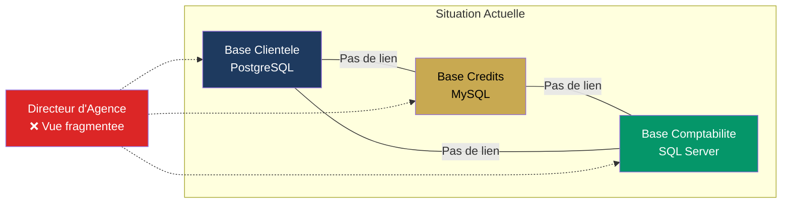

## 1.3 Solution proposee

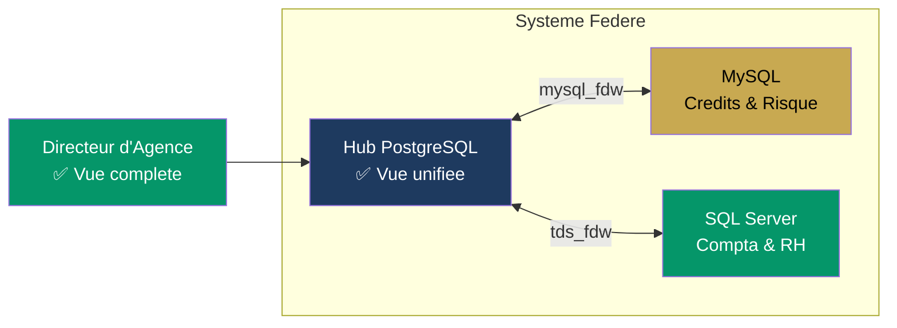

---

# 2. Cas d'Utilisation

## 2.1 Identification des acteurs

| Acteur | Description | Type |
|--------|------------|------|
| DirecteurAgence | Responsable d'une agence bancaire. Consulte les indicateurs et tableaux de bord. | Principal |
| AgentCredit | Agent en charge des dossiers de credit. Cree et suit les dossiers. | Principal |
| AnalysteRisque | Analyste charge d'evaluer le risque de credit. Consulte les scores et historiques. | Principal |
| Comptable | Agent comptable. Consulte les ecritures et le plan comptable OHADA. | Secondaire |
| AdministrateurSysteme | Technicien en charge de la maintenance. Gere la federation et les conteneurs. | Secondaire |

## 2.2 Diagramme des cas d'utilisation global

```mermaid
useCaseDiagram
    actor DirecteurAgence
    actor AgentCredit
    actor AnalysteRisque
    actor Comptable
    actor AdministrateurSysteme

    package "Gestion de la Clientele" {
        usecase "Consulter profil client complet" as UC1
        usecase "Rechercher un client" as UC2
        usecase "Creer un client" as UC3
        usecase "Consulter les comptes d'un client" as UC4
    }

    package "Gestion des Credits" {
        usecase "Creer un dossier de credit" as UC5
        usecase "Consulter un dossier de credit" as UC6
        usecase "Ajouter une garantie" as UC7
        usecase "Consulter l'echeancier" as UC8
        usecase "Evaluer le risque de credit" as UC9
    }

    package "Operations Comptables" {
        usecase "Consulter les operations" as UC10
        usecase "Consulter les ecritures comptables" as UC11
        usecase "Creer une transaction" as UC12
    }

    package "Tableau de Bord" {
        usecase "Consulter les indicateurs par agence" as UC13
        usecase "Consulter le tableau de bord global" as UC14
        usecase "Identifier les clients a risque" as UC15
    }

    package "Administration" {
        usecase "Verifier l'etat de la federation" as UC16
        usecase "Rafraichir les vues materialisees" as UC17
        usecase "Lancer la reconciliation" as UC18
    }

    DirecteurAgence --> UC1
    DirecteurAgence --> UC13
    DirecteurAgence --> UC14
    DirecteurAgence --> UC15

    AgentCredit --> UC1
    AgentCredit --> UC2
    AgentCredit --> UC3
    AgentCredit --> UC5
    AgentCredit --> UC6
    AgentCredit --> UC7
    AgentCredit --> UC8

    AnalysteRisque --> UC1
    AnalysteRisque --> UC6
    AnalysteRisque --> UC9
    AnalysteRisque --> UC15

    Comptable --> UC10
    Comptable --> UC11
    Comptable --> UC12

    AdministrateurSysteme --> UC16
    AdministrateurSysteme --> UC17
    AdministrateurSysteme --> UC18
```

## 2.3 Details des cas d'utilisation principaux

[Pour CHAQUE cas d'utilisation, fournir une fiche detaillee avec le format suivant :]

### UC1 — Consulter profil client complet

| Champ | Valeur |
|-------|--------|
| **ID** | UC1 |
| **Acteur principal** | DirecteurAgence, AgentCredit, AnalysteRisque |
| **Objectif** | Obtenir une vue unifiee du profil d'un client avec ses comptes et son score de risque |
| **Pre-conditions** | Le client existe dans PostgreSQL. Les serveurs FDW sont operationnels. |
| **Post-conditions** | Le profil complet est affiche (donnees locales + scoring distant) |
| **Scenario nominal** | 1. L'acteur saisit l'ICF ou recherche le client<br>2. Le systeme interroge la vue federee vue_client_complet<br>3. PostgreSQL joint les tables locales (client, compte) et la foreign table (scoring) via l'ICF<br>4. Le profil complet est retourne avec score de risque |
| **Scenarios alternatifs** | A1. Client non trouve → message 404<br>A2. MySQL indisponible → profil partiel sans score |
| **Frequence** | Elevee (50+ fois/jour) |
| **Performance cible** | < 2 secondes |

[Repeter pour UC2 a UC18]

---

# 3. Modele Conceptuel de Donnees (MCD)

## 3.1 Diagramme Entite-Association global

```mermaid
erDiagram
    %% ============================================
    %% ENTITES DU HUB POSTGRESQL
    %% ============================================
    AGENCE {
        int id_agence PK
        string nom
        string ville
        string adresse
        string code_agence UK
    }

    EMPLOYE {
        int id_employe PK
        string nom
        string prenom
        string poste
        int id_agence FK
        date date_embauche
    }

    CLIENT {
        int id_client PK
        string nom
        string prenom
        date date_naissance
        string numero_piece UK
        string icf UK
        string telephone
        string email
        string adresse
        int id_agence FK
    }

    COMPTE {
        int id_compte PK
        string iban UK
        string type_compte
        float solde
        date date_ouverture
        string statut
        int id_client FK
        int id_agence FK
    }

    TRANSACTION {
        int id_transaction PK
        string type_operation
        float montant
        string devise
        datetime date_heure
        int id_compte_source FK
        int id_compte_dest FK
    }

    %% ============================================
    %% ENTITES DE LA BASE MYSQL
    %% ============================================
    DOSSIER_CREDIT {
        int id_dossier PK
        float montant_demande
        float montant_accorde
        int duree_mois
        float taux
        string statut
        string icf FK
        int id_agent FK
    }

    GARANTIE {
        int id_garantie PK
        string type_garantie
        float valeur_estimee
        int id_dossier FK
    }

    ECHEANCIER {
        int id_echeance PK
        date date_echeance
        float montant_capital
        float montant_interet
        string statut_paiement
        int id_dossier FK
    }

    SCORING {
        int id_scoring PK
        int score
        string niveau_risque
        datetime date_evaluation
        string icf FK
    }

    %% ============================================
    %% ENTITES DE LA BASE SQL SERVER
    %% ============================================
    PLAN_COMPTABLE {
        string numero_compte PK
        string libelle
        int classe_compte
        string sous_classe
    }

    ECRITURE_COMPTABLE {
        int id_ecriture PK
        date date_ecriture
        string libelle
        float debit
        float credit
        string numero_compte FK
        string journal
        int id_agence FK
    }

    BULLETIN_PAIE {
        int id_bulletin PK
        int mois
        int annee
        float salaire_brut
        float salaire_net
        float net_a_payer
        int id_employe FK
        int id_agence FK
    }

    OPERATION_AGENCE {
        int id_operation PK
        string type_operation
        float montant
        string devise
        datetime date_operation
        int id_agence FK
        int id_employe FK
    }

    %% ============================================
    %% RELATIONS
    %% ============================================
    AGENCE ||--o{ EMPLOYE : "emploie"
    AGENCE ||--o{ CLIENT : "accueille"
    AGENCE ||--o{ COMPTE : "heberge"
    CLIENT ||--o{ COMPTE : "possede"
    COMPTE ||--o{ TRANSACTION : "source de"
    COMPTE ||--o{ TRANSACTION : "destination de"
    EMPLOYE ||--o{ DOSSIER_CREDIT : "instruit"
    DOSSIER_CREDIT ||--o{ GARANTIE : "garanti par"
    DOSSIER_CREDIT ||--o{ ECHEANCIER : "rembourse selon"
    PLAN_COMPTABLE ||--o{ ECRITURE_COMPTABLE : "comptabilise dans"
    AGENCE ||--o{ OPERATION_AGENCE : "realise"
    EMPLOYE ||--o{ BULLETIN_PAIE : "percoit"
    AGENCE ||--o{ ECRITURE_COMPTABLE : "concerne"

    %% Relations federees via ICF (distantes, pointilles)
    CLIENT ..|| DOSSIER_CREDIT : "identifie par ICF"
    CLIENT ..|| SCORING : "evalue par ICF"
```

## 3.2 Explication du MCD

[Minimum 300 mots. Expliquer :
- Les 3 sous-modeles correspondant aux 3 bases de donnees
- La distinction entre relations locales (pleines) et relations federees (pointilles)
- Le role de l'ICF comme cle de jonction entre les sous-modeles
- Les cardinalites et leur signification metier
- Les choix de modelisation (pourquoi Transaction est dans PG et pas dans MSSQL, etc.)
]

## 3.3 Sous-modele PostgreSQL — Clientele et Comptes

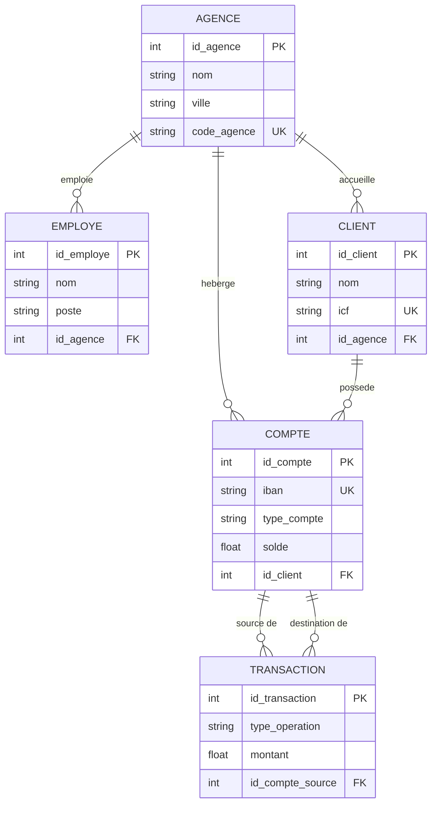

## 3.4 Sous-modele MySQL — Credits et Risque

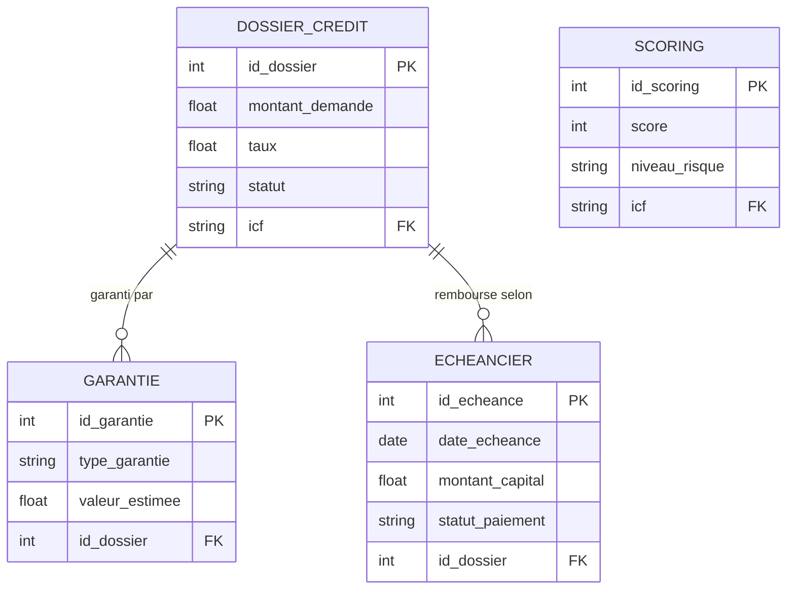

## 3.5 Sous-modele SQL Server — Comptabilite et RH

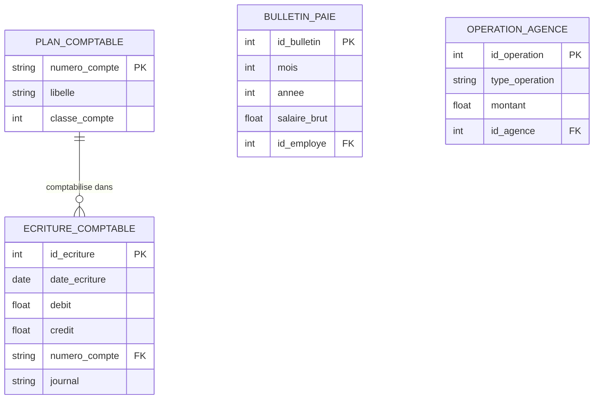

## 3.6 Mecanisme ICF — Cle de federation

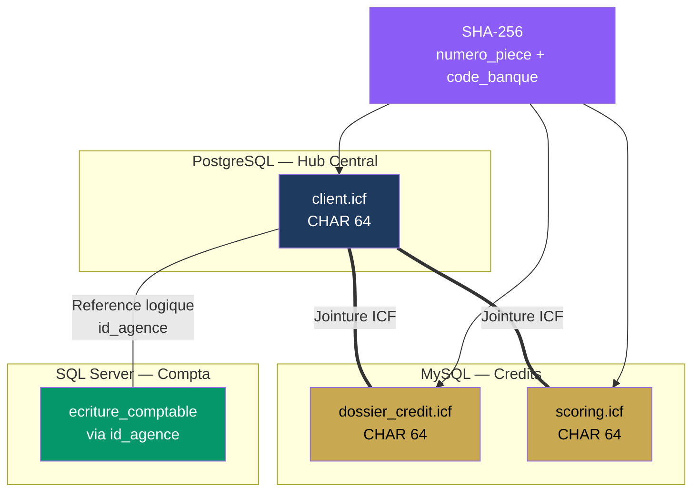

---

# 4. Modele Logique de Donnees (MLD)

## 4.1 Schema relationnel PostgreSQL

[Presente sous forme de schemas relationnels classiques avec cles soulignees et cles etrangeres]

```
agence (#id_agence, nom, ville, adresse, code_agence*)
employe (#id_employe, nom, prenom, poste, id_agence→agence, date_embauche)
client (#id_client, nom, prenom, date_naissance, numero_piece*, icf*, telephone, email, adresse, id_agence→agence, date_creation)
compte (#id_compte, iban*, type_compte, solde, date_ouverture, statut, id_client→client, id_agence→agence)
transaction (#id_transaction, type_operation, montant, devise, date_heure, id_compte_source→compte, id_compte_dest→compte)
```

*Légende : # = cle primaire, * = unique, → = cle etrangere*

## 4.2 Schema relationnel MySQL

```
dossier_credit (#id_dossier, montant_demande, montant_accorde, duree_mois, taux, statut, icf, id_agent→employé[logique], date_soumission, date_decision, motif_rejet)
garantie (#id_garantie, type_garantie, valeur_estimee, description, id_dossier→dossier_credit, date_evaluation)
echeancier (#id_echeance, date_echeance, montant_capital, montant_interet, statut_paiement, date_paiement_effectif, id_dossier→dossier_credit)
scoring (#id_scoring, score, niveau_risque, date_evaluation, icf, commentaire)
```

## 4.3 Schema relationnel SQL Server

```
plan_comptable (#numero_compte, libelle, classe_compte, sous_classe)
ecriture_comptable (#id_ecriture, date_ecriture, libelle, debit, credit, numero_compte→plan_comptable, journal, id_agence[logique], piece_justificative, date_saisie)
bulletin_paie (#id_bulletin, mois, annee, salaire_brut, salaire_net, net_a_payer, id_employe[logique], id_agence[logique], date_emission)
operation_agence (#id_operation, type_operation, montant, devise, date_operation, id_agence[logique], id_employe[logique], description)
```

## 4.4 Tableau des correspondances inter-bases

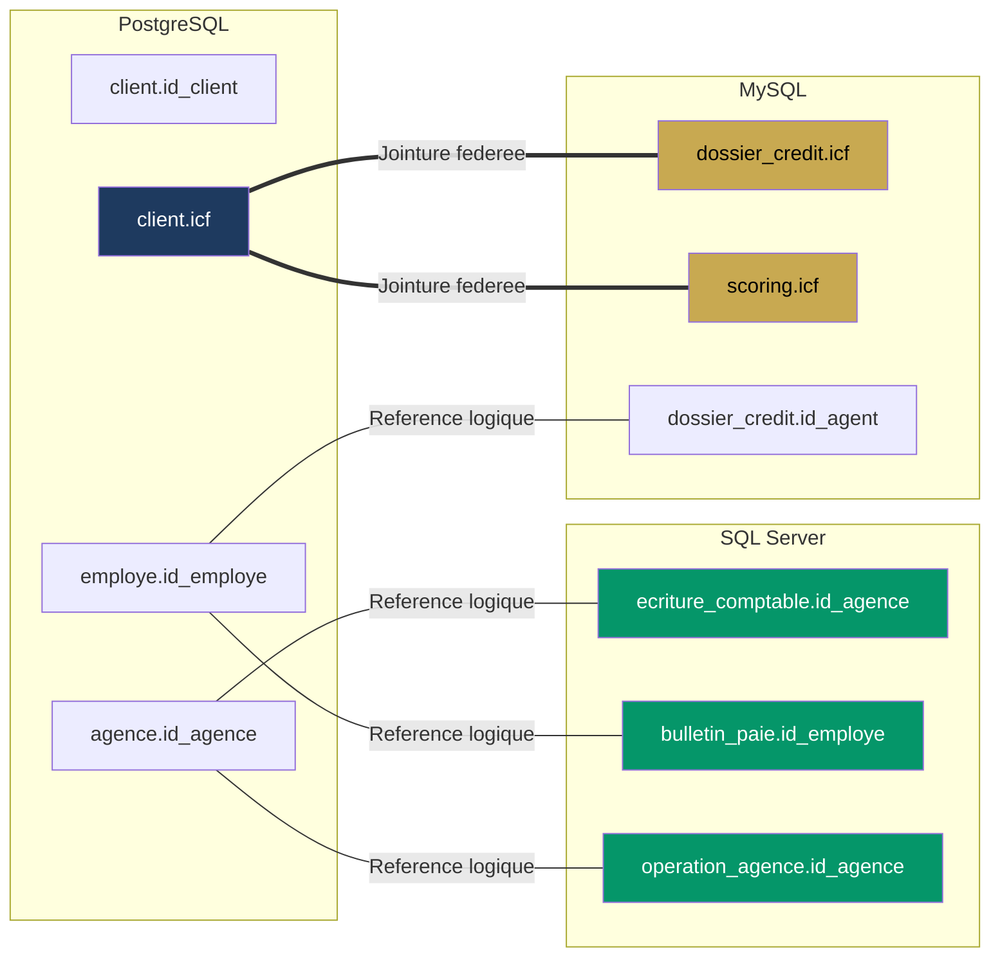

[Texte explicatif minimum 200 mots sur les references logiques vs cles etrangeres FDW]

---

# 5. Modele Physique de Donnees (MPD)

## 5.1 PostgreSQL — Types physiques et index

[Tableau detaille avec types PostgreSQL natifs]

| Table | Colonne | Type PostgreSQL | Contrainte | Index |
|-------|---------|----------------|------------|-------|
| agence | id_agence | SERIAL | PRIMARY KEY | — |
| agence | code_agence | VARCHAR(10) | UNIQUE | B-tree UNIQUE |
| client | icf | CHAR(64) | UNIQUE NOT NULL | B-tree UNIQUE (idx_client_icf) |
| client | numero_piece | VARCHAR(50) | UNIQUE | B-tree UNIQUE |
| compte | iban | VARCHAR(34) | UNIQUE | B-tree UNIQUE (idx_compte_iban) |
| compte | solde | NUMERIC(15,2) | DEFAULT 0.00 | — |
| transaction | montant | NUMERIC(15,2) | CHECK > 0 | — |
| transaction | date_heure | TIMESTAMP | DEFAULT NOW() | B-tree (idx_transaction_date) |
| ... | ... | ... | ... | ... |

## 5.2 MySQL — Types physiques et index

[Tableau detaille avec types MySQL natifs, moteur InnoDB, charset utf8mb4]

| Table | Colonne | Type MySQL | Contrainte | Index |
|-------|---------|-----------|------------|-------|
| dossier_credit | id_dossier | INT AUTO_INCREMENT | PRIMARY KEY | — |
| dossier_credit | icf | CHAR(64) | NOT NULL | B-tree (idx_dossier_icf) |
| dossier_credit | statut | ENUM(...) | NOT NULL | B-tree (idx_dossier_statut) |
| scoring | score | INT | CHECK 0-100 | — |
| scoring | (icf, date_evaluation) | — | — | B-tree composite (idx_scoring_icf_date) |
| ... | ... | ... | ... | ... |

## 5.3 SQL Server — Types physiques et index

[Tableau detaille avec types SQL Server natifs, conformite OHADA]

| Table | Colonne | Type SQL Server | Contrainte | Index |
|-------|---------|----------------|------------|-------|
| plan_comptable | numero_compte | VARCHAR(10) | PRIMARY KEY | — |
| ecriture_comptable | debit | DECIMAL(18,2) | DEFAULT 0, CHECK >= 0 | — |
| ecriture_comptable | date_ecriture | DATE | NOT NULL | Cluster (idx_ecriture_date) |
| ecriture_comptable | (numero_compte, date_ecriture) | — | — | Index couvrant |
| ... | ... | ... | ... | ... |

## 5.4 Strategie d'indexation

[Minimum 200 mots. Expliquer la strategie d'indexation globale :
- Index de jointure federee (ICF dans les 3 bases)
- Index de filtrage frequent (statut, dates, niveaux)
- Index composites pour les requetes multi-criteres
- Index couvrants pour le reporting
- Pourquoi pas d'index sur les foreign tables (gere par la base distante)
]

---

# 6. Architecture du Systeme

## 6.1 Diagramme d'architecture globale

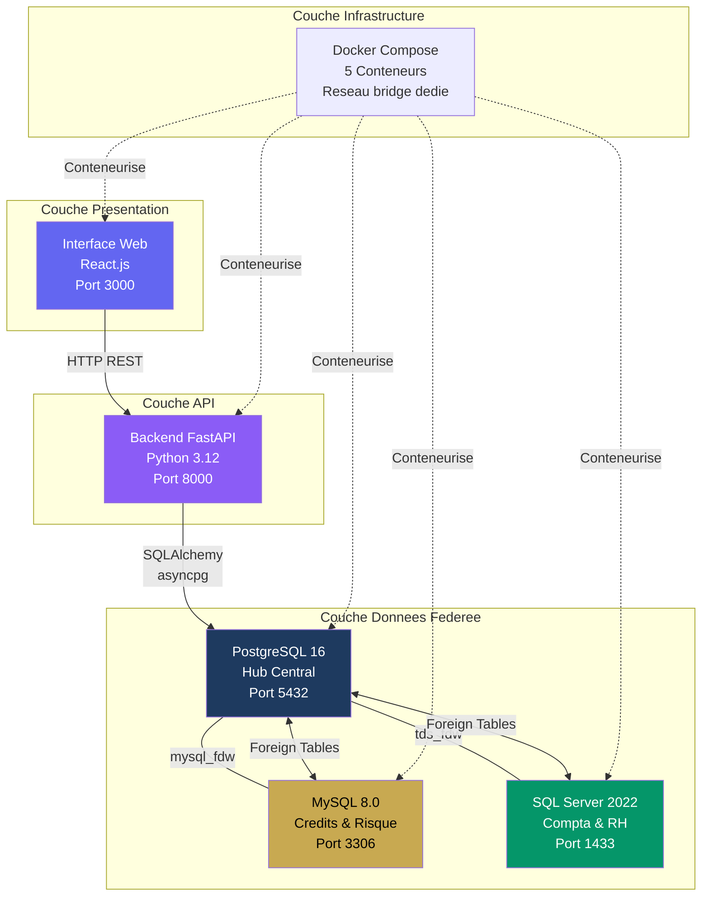

## 6.2 Diagramme d'architecture en couches

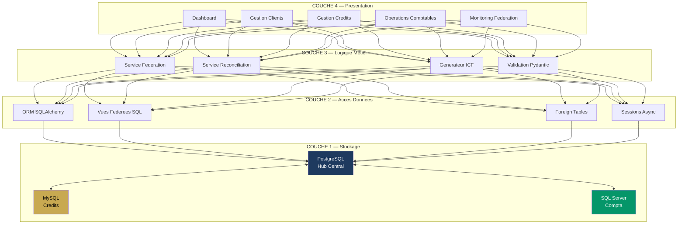

---

# 7. Diagramme de Sequence

## 7.1 Consultation d'un profil client complet

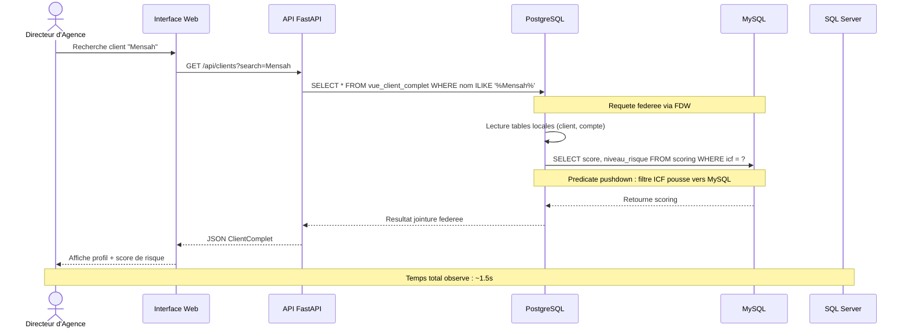

## 7.2 Creation d'un dossier de credit

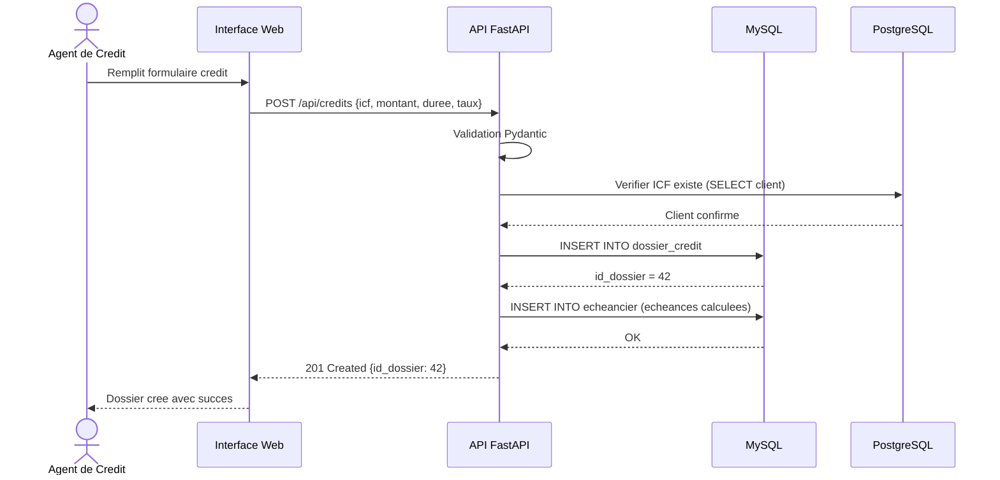

## 7.3 Reconciliation des donnees

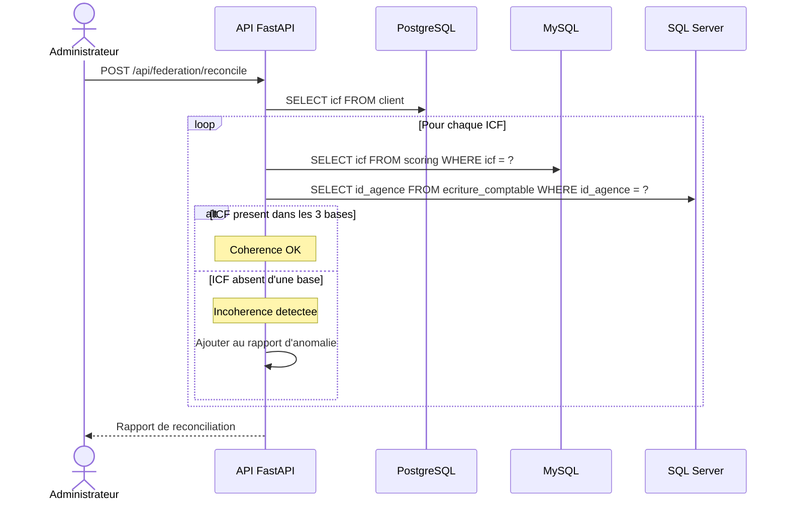

## 7.4 Rafraichissement des vues materialisees

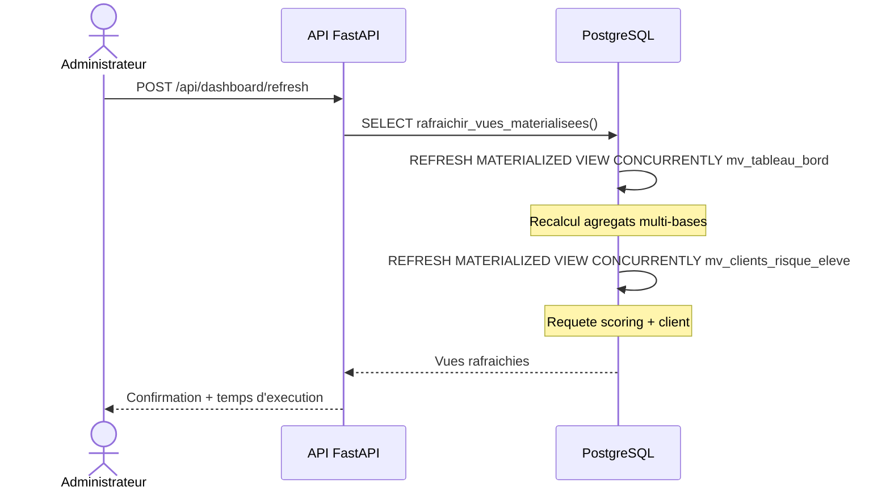

---

# 8. Diagramme d'Activite

## 8.1 Processus de creation d'un client

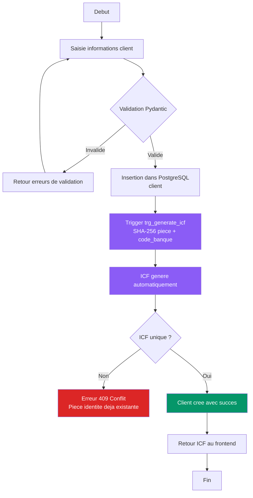

## 8.2 Processus d'evaluation d'un credit

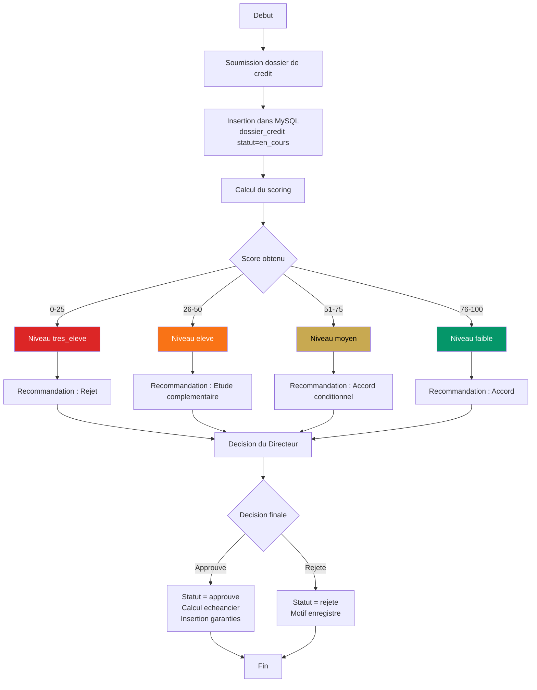

## 8.3 Processus de reconciliation

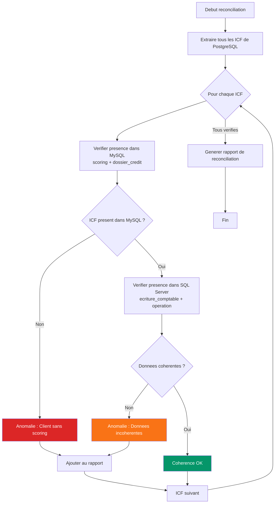

---

# 9. Diagramme de Deploiement

## 9.1 Deploiement Docker

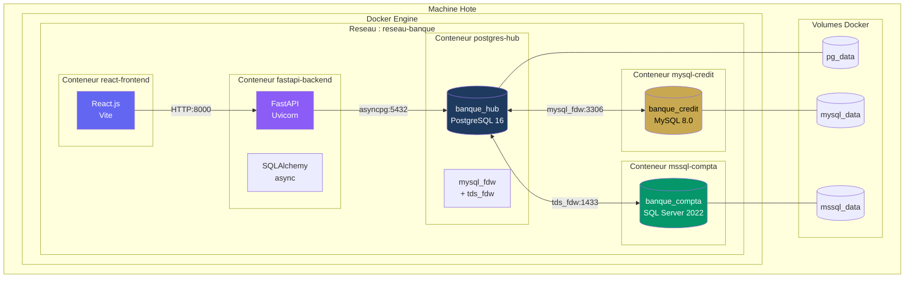

## 9.2 Ports et communication

| Source | Destination | Port | Protocole | Usage |
|--------|------------|------|-----------|-------|
| react-frontend | fastapi-backend | 8000 | HTTP | Appels API REST |
| fastapi-backend | postgres-hub | 5432 | PostgreSQL | Requetes SQL + vues federees |
| postgres-hub | mysql-credit | 3306 | MySQL (FDW) | Foreign tables mysql_fdw |
| postgres-hub | mssql-compta | 1433 | TDS (FDW) | Foreign tables tds_fdw |
| Utilisateur | react-frontend | 3000 | HTTP | Interface web |
| Utilisateur | fastapi-backend | 8000 | HTTP | Swagger API docs |

---

# 10. Diagramme de Composants

## 10.1 Composants du Backend

```mermaid
graph TB
    subgraph "Backend FastAPI"
        subgraph "Routers"
            R1[Router Clients\nGET POST /api/clients]
            R2[Router Credits\nGET POST /api/credits]
            R3[Router Operations\nGET POST /api/operations]
            R4[Router Dashboard\nGET /api/dashboard]
        end

        subgraph "Services"
            S1[Service Federation\nRequetes vues federees]
            S2[Service Reconciliation\nCoherence inter-bases]
        end

        subgraph "Utils"
            U1[Generateur ICF\nSHA-256]
            U2[Validation Pydantic\nSchemas]
        end

        subgraph "Acces Donnees"
            DB1[Session PostgreSQL\nasyncpg]
            DB2[Session MySQL\naiomysql]
        end
    end

    R1 & R2 & R3 & R4 --> S1
    S1 --> DB1
    R1 & R2 --> S2
    S2 --> DB1 & DB2
    R1 --> U1
    R1 & R2 & R3 & R4 --> U2

    style S1 fill:#8b5cf6,color:#fff
    style S2 fill:#8b5cf6,color:#fff
    style U1 fill:#c8a951,color:#000
```

## 10.2 Composants du Frontend

```mermaid
graph TB
    subgraph "Frontend React"
        subgraph "Pages"
            P1[DashboardPage\nIndicateurs + Graphiques]
            P2[ClientsPage\nListe + Recherche]
            P3[CreditsPage\nDossiers + Filtres]
            P4[OperationsPage\nTransactions + Compta]
            P5[FederationPage\nMonitoring technique]
        end

        subgraph "Composants"
            C1[StatCard\nIndicateurs chiffres]
            C2[DataTable\nTableau pagine]
            C3[Badge\nStatuts + Risque]
            C4[SearchBar\nRecherche debounce]
            C5[FormatCurrency\nMontants FCFA]
        end

        subgraph "API Layer"
            AL[Axios Client\nProxy /api]
        end
    end

    P1 --> C1 & C2 & C3 & C5
    P2 --> C2 & C4 & C3
    P3 --> C2 & C3
    P4 --> C2 & C5
    P1 & P2 & P3 & P4 & P5 --> AL

    style AL fill:#6366f1,color:#fff
```

---

# 11. Federation FDW — Diagramme Detaille

## 11.1 Mecanisme de federation pas a pas

```mermaid
sequenceDiagram
    participant App as Application
    participant PG as PostgreSQL\nHub Central
    participant FDW as mysql_fdw\nExtension
    participant MY as MySQL\nBase distante

    Note over App,MY: Etape 1 — Configuration

    App->>PG: CREATE EXTENSION mysql_fdw
    App->>PG: CREATE SERVER mysql_server OPTIONS (host, port, dbname)
    App->>PG: CREATE USER MAPPING FOR banque_admin SERVER mysql_server OPTIONS (user, password)

    Note over App,MY: Etape 2 — Declaration des Foreign Tables

    App->>PG: CREATE FOREIGN TABLE fdw_dossier_credit (...) SERVER mysql_server OPTIONS (table_name 'dossier_credit')

    Note over App,MY: Etape 3 — Requete federee

    App->>PG: SELECT * FROM fdw_dossier_credit WHERE statut = 'approuve'
    PG->>FDW: Delegation de la requete
    FDW->>MY: SELECT id_dossier, montant_demande, ... FROM dossier_credit WHERE statut = 'approuve'

    Note over FDW,MY: Predicate Pushdown : le filtre WHERE est execute par MySQL

    MY-->>FDW: Resultats filtres
    FDW-->>PG: Tuples distants
    PG-->>App: Resultat final
```

## 11.2 Carte des Foreign Tables

```mermaid
graph TB
    subgraph "PostgreSQL — Foreign Tables MySQL"
        FT1[fdw_dossier_credit]
        FT2[fdw_garantie]
        FT3[fdw_echeancier]
        FT4[fdw_scoring]
    end

    subgraph "PostgreSQL — Foreign Tables SQL Server"
        FT5[fdw_ecriture_comptable]
        FT6[fdw_plan_comptable]
        FT7[fdw_bulletin_paie]
        FT8[fdw_operation_agence]
    end

    subgraph "MySQL — Tables reelles"
        MT1[dossier_credit]
        MT2[garantie]
        MT3[echeancier]
        MT4[scoring]
    end

    subgraph "SQL Server — Tables reelles"
        ST1[ecriture_comptable]
        ST2[plan_comptable]
        ST3[bulletin_paie]
        ST4[operation_agence]
    end

    FT1 -.->|mysql_fdw| MT1
    FT2 -.->|mysql_fdw| MT2
    FT3 -.->|mysql_fdw| MT3
    FT4 -.->|mysql_fdw| MT4
    FT5 -.->|tds_fdw| ST1
    FT6 -.->|tds_fdw| ST2
    FT7 -.->|tds_fdw| ST3
    FT8 -.->|tds_fdw| ST4

    style FT1 fill:#1e3a5f,color:#fff
    style FT2 fill:#1e3a5f,color:#fff
    style FT3 fill:#1e3a5f,color:#fff
    style FT4 fill:#1e3a5f,color:#fff
    style FT5 fill:#1e3a5f,color:#fff
    style FT6 fill:#1e3a5f,color:#fff
    style FT7 fill:#1e3a5f,color:#fff
    style FT8 fill:#1e3a5f,color:#fff
    style MT1 fill:#c8a951,color:#000
    style MT2 fill:#c8a951,color:#000
    style MT3 fill:#c8a951,color:#000
    style MT4 fill:#c8a951,color:#000
    style ST1 fill:#059669,color:#fff
    style ST2 fill:#059669,color:#fff
    style ST3 fill:#059669,color:#fff
    style ST4 fill:#059669,color:#fff
```

---

# 12. Vues Federees — Cartographie

## 12.1 Vue 1 — vue_client_complet

```mermaid
graph LR
    subgraph "Sources PostgreSQL"
        C[client]
        CO[compte]
        A[agence]
    end

    subgraph "Source MySQL"
        S[fdw_scoring]
    end

    subgraph "Vue Federee"
        VC[vue_client_complet]
    end

    C --> VC
    CO --> VC
    A --> VC
    S -->|Jointure ICF| VC

    VC --> RES[id_client, nom, prenom,\nicf, agence, nb_comptes,\nsolde_total, score_risque,\nniveau_risque]

    style C fill:#1e3a5f,color:#fff
    style CO fill:#1e3a5f,color:#fff
    style A fill:#1e3a5f,color:#fff
    style S fill:#c8a951,color:#000
    style VC fill:#8b5cf6,color:#fff
    style RES fill:#f8fafc
```

## 12.2 Vue 2 — vue_credit_detail

```mermaid
graph LR
    subgraph "Source PostgreSQL"
        C[client]
        A[agence]
        E[employe]
    end

    subgraph "Sources MySQL"
        DC[fdw_dossier_credit]
        G[fdw_garantie]
        EC[fdw_echeancier]
    end

    subgraph "Vue Federee"
        VCD[vue_credit_detail]
    end

    C -->|Jointure ICF| VCD
    A --> VCD
    E --> VCD
    DC --> VCD
    G -->|Sous-requete| VCD
    EC -->|Sous-requete| VCD

    style C fill:#1e3a5f,color:#fff
    style A fill:#1e3a5f,color:#fff
    style E fill:#1e3a5f,color:#fff
    style DC fill:#c8a951,color:#000
    style G fill:#c8a951,color:#000
    style EC fill:#c8a951,color:#000
    style VCD fill:#8b5cf6,color:#fff
```

## 12.3 Vue 3 — vue_operation_comptable

```mermaid
graph LR
    subgraph "Sources PostgreSQL"
        T[transaction]
        CO[compte]
    end

    subgraph "Sources SQL Server"
        ECR[fdw_ecriture_comptable]
        PC[fdw_plan_comptable]
    end

    subgraph "Vue Federee"
        VOC[vue_operation_comptable]
    end

    T --> VOC
    CO --> VOC
    ECR -->|Jointure id_agence + date| VOC
    PC -->|Jointure numero_compte| VOC

    style T fill:#1e3a5f,color:#fff
    style CO fill:#1e3a5f,color:#fff
    style ECR fill:#059669,color:#fff
    style PC fill:#059669,color:#fff
    style VOC fill:#8b5cf6,color:#fff
```

## 12.4 Vue 4 — vue_tableau_bord

```mermaid
graph LR
    subgraph "Sources PostgreSQL"
        A[agence]
        CO[compte]
    end

    subgraph "Sources MySQL"
        DC[fdw_dossier_credit]
    end

    subgraph "Sources SQL Server"
        OA[fdw_operation_agence]
    end

    subgraph "Vue Federee"
        VTB[vue_tableau_bord]
    end

    A --> VTB
    CO -->|Agregation| VTB
    DC -->|Agregation| VTB
    OA -->|Agregation| VTB

    VTB --> RES[id_agence, nb_comptes_actifs,\nsolde_total, nb_credits,\nvolume_credits, nb_operations]

    style A fill:#1e3a5f,color:#fff
    style CO fill:#1e3a5f,color:#fff
    style DC fill:#c8a951,color:#000
    style OA fill:#059669,color:#fff
    style VTB fill:#8b5cf6,color:#fff
    style RES fill:#f8fafc
```

---

# 13. Synthese et Resultats

## 13.1 Bilan technique

[Minimum 300 mots. Synthese des resultats techniques :
- Federation fonctionnelle entre 3 SGBD heterogenes
- Performance des requetes federees (temps de reponse observes)
- Predicate pushdown effectif sur mysql_fdw
- Fiabilite des vues federees
- Limitations rencontrees
- Lecons apprises
]

## 13.2 Bilan fonctionnel

[Tableau recapitulatif des fonctionnalites :

| Fonctionnalite | Statut | Commentaire |
|---------------|--------|-------------|
| Consultation profil client complet | Fonctionnel | Via vue_client_complet |
| Recherche multi-criteres | Fonctionnel | Par nom, risque, agence |
| Creation de client | Fonctionnel | ICF auto-genere |
| Consultation dossiers de credit | Fonctionnel | Via vue_credit_detail |
| Creation dossier de credit | Fonctionnel | Ecriture directe MySQL |
| Operations comptables | Fonctionnel | Via vue_operation_comptable |
| Tableau de bord | Fonctionnel | Via vue_tableau_bord |
| Vues materialisees | Fonctionnel | Rafraichissement manuel |
| Reconciliation | Partiellement | Detection seule, correction manuelle |
| Ecriture distribuee | Non implemente | Hors perimetre |
]

## 13.3 Perspectives

[Minimum 200 mots. Ameliorations possibles :
- Authentification et gestion des roles
- Ecriture distribuee via 2PC
- Replication en temps reel
- Cache pour les requetes federees
- Rafraichissement automatique des vues materialisees
- Notifications en temps reel
- Export PDF des rapports
- Interface mobile
- Deploiement en production (Kubernetes)
]

## 13.4 Diagramme de synthese

```mermaid
graph TB
    subgraph "AVANT — Systeme Fragmente"
        A1[PostgreSQL\nClientele] ---x A2[MySQL\nCredits]
        A2 ---x A3[SQL Server\nCompta]
        A1 ---x A3
        A4[❌ Pas de vue globale] -.-> A1
    end

    subgraph "APRES — Systeme Federe"
        B1[Hub PostgreSQL\nMediateur FDW]
        B1 <-->|mysql_fdw| B2[MySQL\nCredits]
        B1 <-->|tds_fdw| B3[SQL Server\nCompta]
        B4[✅ Vue unifiee] --> B1
        B5[API REST] --> B1
        B6[Interface Web] --> B5
    end

    A1 -.->|Transformation| B1
    A2 -.->|Transformation| B2
    A3 -.->|Transformation| B3

    style B4 fill:#059669,color:#fff
    style B5 fill:#8b5cf6,color:#fff
    style B6 fill:#6366f1,color:#fff
    style A4 fill:#dc2626,color:#fff
```
```

---

## INSTRUCTIONS POUR L'AGENT

### Processus de redaction

1. **Lire le code reel** — Chaque diagramme doit refleter l'implementation reelle du projet. Verifier les tables, les colonnes, les relations, les endpoints avant de les inclure.
2. **Tester les diagrammes Mermaid** — S'assurer que la syntaxe Mermaid est correcte et que les diagrammes s'affichent correctement dans un rendu Markdown.
3. **Adapter les cardinalites** — Les cardinalites du MCD doivent correspondre aux contraintes SQL reelles (NOT NULL, UNIQUE, FOREIGN KEY).
4. **Completude des cas d'utilisation** — Chaque endpoint API correspond a au moins un cas d'utilisation. Verifier la couverture.
5. **Coherence des couleurs** — Respecter la palette definie dans les conventions. PostgreSQL = bleu marine, MySQL = or, SQL Server = vert.
6. **Texte entre les diagrammes** — Chaque diagramme doit etre precede et/ou suivi d'un texte explicatif (minimum 150 mots). Ne jamais laisser un diagramme sans explication.

### Diagrammes les plus importants

Par ordre de priorite pour la presentation orale :

1. **MCD global (section 3.1)** — C'est le diagramme le plus attendu par un jury d'examen de base de donnees.
2. **Cas d'utilisation (section 2.2)** — Montre la couverture fonctionnelle du systeme.
3. **Sequence — Consultation client (section 7.1)** — Demontre le fonctionnement concret de la federation.
4. **Architecture (section 6.1)** — Vue d'ensemble du systeme.
5. **Federation FDW (section 11.1)** — Montre la maitrise technique du mecanisme cle.

### Regles Mermaid specifiques

- **Ne pas utiliser de caracteres speciaux** (accents, emojis) dans les labels Mermaid. Remplacer les accents par des caracteres ASCII (e → e, a → a, etc.) dans les diagrammes. Le texte explicatif en francais normal est en dehors des blocs Mermaid.
- **Limiter la complexite** : Un diagramme Mermaid ne doit pas depasser 30-40 noeuds. Si le MCD est trop grand, le decomposer en sous-modeles (deja prevu dans la structure).
- **Utiliser des subgraphs** pour grouper les elements par base de donnees ou par couche.
- **Prefere graph TB** (top-bottom) pour les diagrammes d'architecture et **sequenceDiagram** pour les interactions.
- **Utiliser des styles** pour colorer les noeuds selon la base de donnees qu'ils representent.

### Validation finale

Avant de considerer le document comme final, verifier :

- [ ] Chaque diagramme Mermaid est syntaxiquement correct (tester dans un rendu Markdown)
- [ ] Les entites du MCD correspondent aux tables SQL reelles
- [ ] Les cardinalites du MCD sont coherentes avec les contraintes SQL
- [ ] Les cas d'utilisation couvrent tous les endpoints API
- [ ] Les sequences decrivent des scénarios reels et testes
- [ ] La palette de couleurs est respectee dans tous les diagrammes
- [ ] Chaque diagramme est accompagne d'un texte explicatif
- [ ] Le document peut etre projete et presente sans modification
- [ ] Le document est autonome — compréhensible sans avoir lu les autres documents du projet
