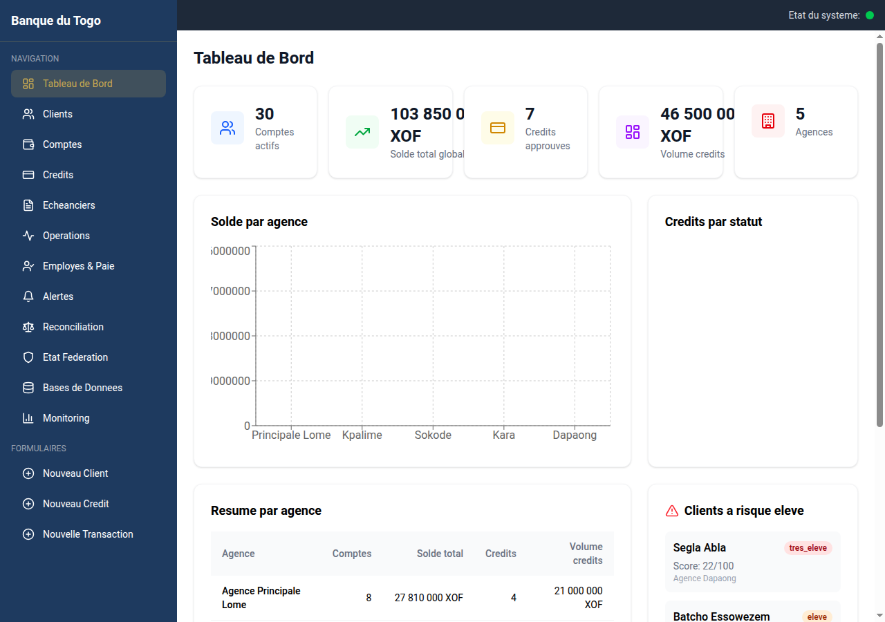
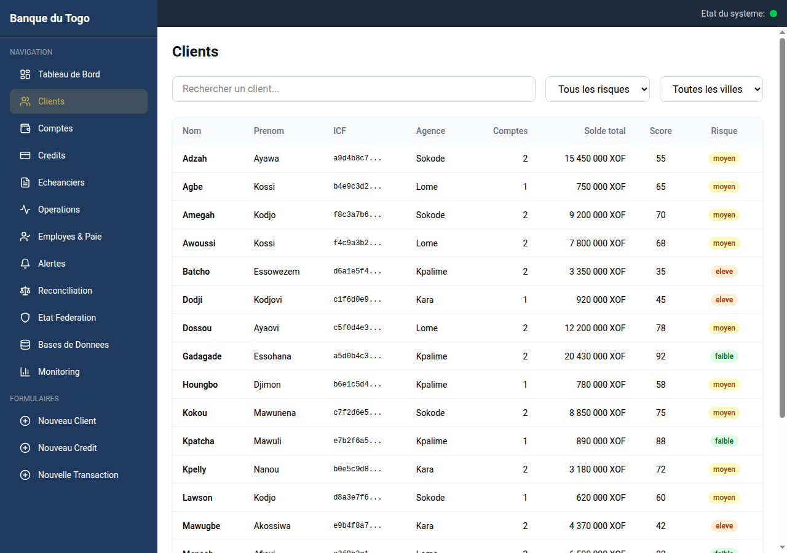
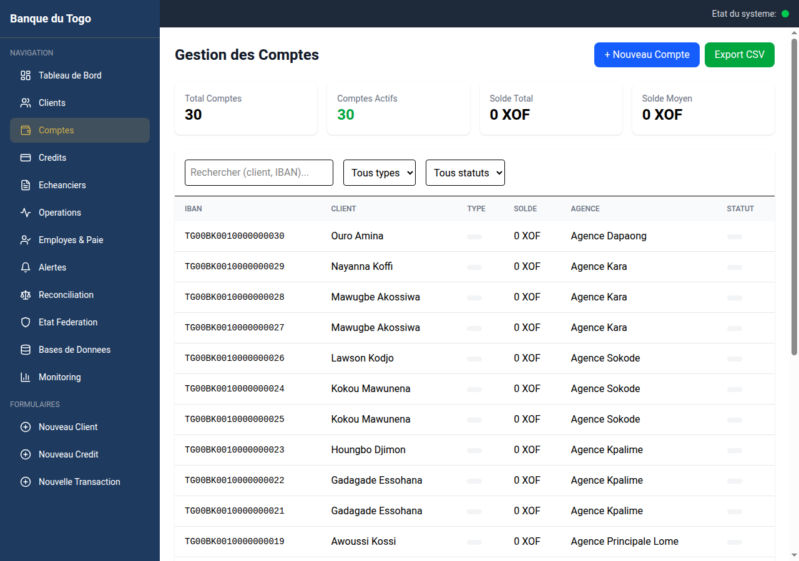
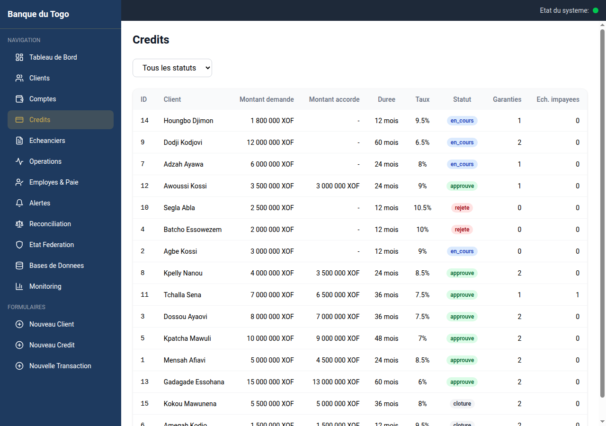
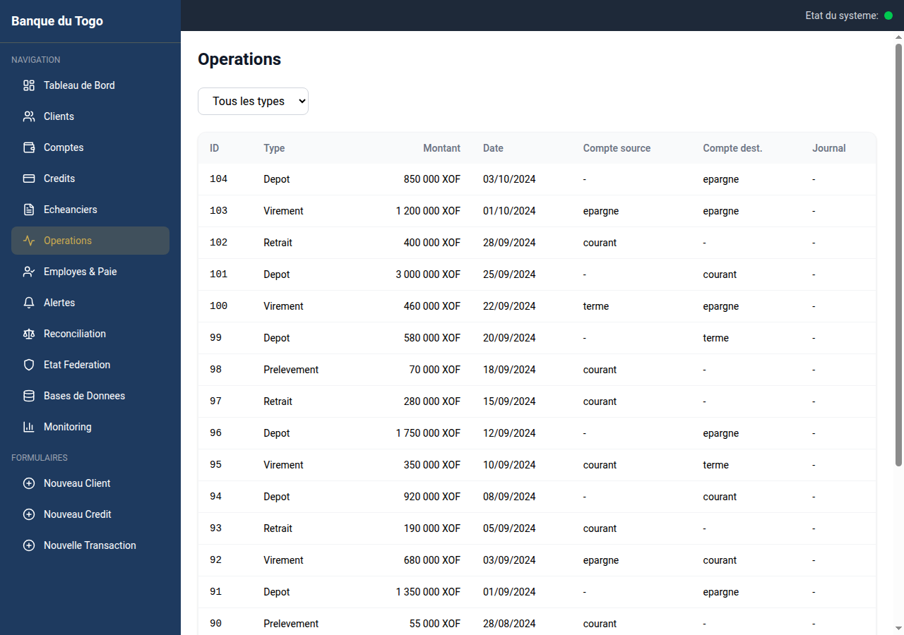
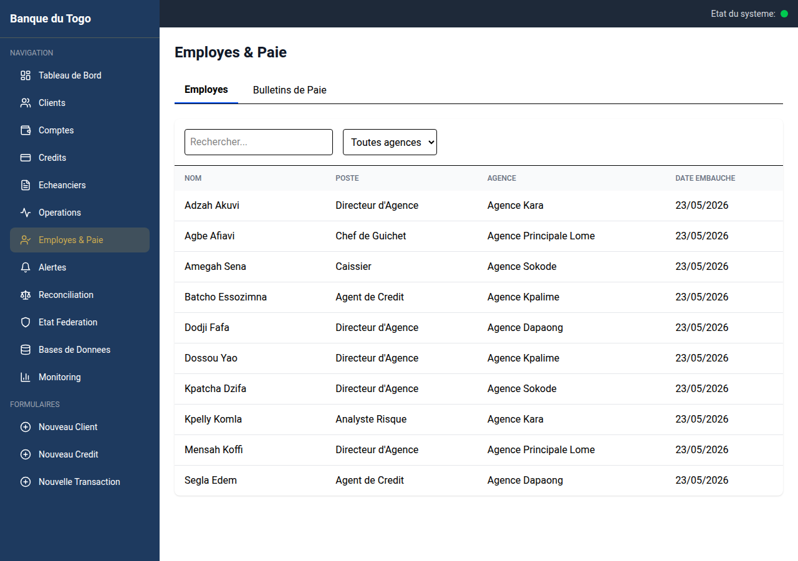
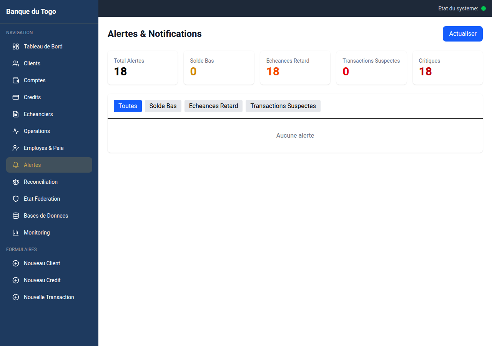
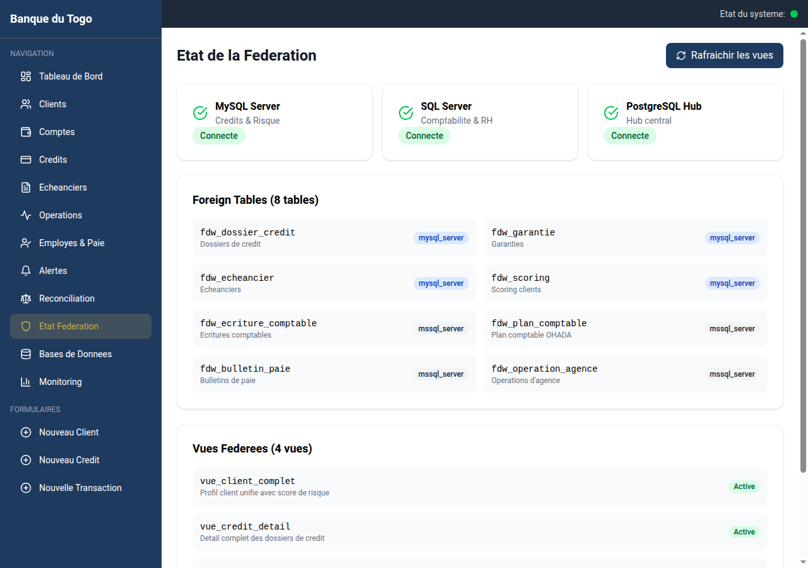
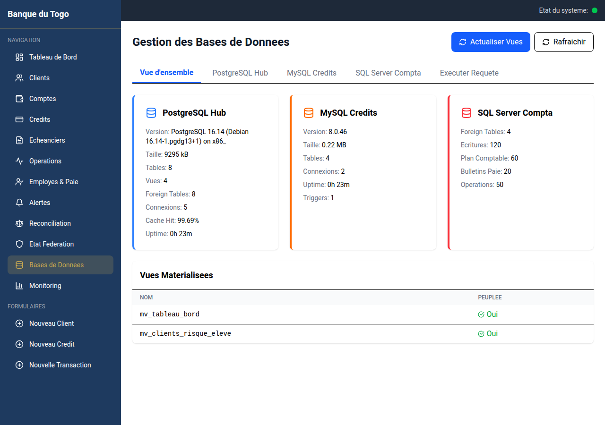

# Systeme de Bases de Donnees Federees - Banque Commerciale du Togo

[](https://github.com/votre-organisation/projet-fin-dba)
[](https://fastapi.tiangolo.com)
[](https://reactjs.org)
[](https://www.postgresql.org)
[](https://www.mysql.com)
[](https://www.microsoft.com/en-us/sql-server)

## Description

Ce projet implemente un **systeme de bases de donnees federees** pour la gestion integree des donnees d'une banque commerciale au Togo. Il offre une interface d'acces unifiee a **trois sources de donnees heterogenes** (PostgreSQL, MySQL, SQL Server) interconnectees via **Foreign Data Wrappers (FDW)**, tout en preservant l'autonomie de chaque base.

Le systeme couvre les domaines suivants :
- **Gestion des clients et comptes** (PostgreSQL - Hub central)
- **Credits et scoring risque** (MySQL)
- **Comptabilite et ressources humaines** (SQL Server)

> **Normes respectees** : OHADA (comptabilite), BCEAO/UEMOA (reglementation bancaire)

---

## Architecture

```
                     +-----------------------------------+
                     |      INTERFACE WEB (React 18)     |
                     |           Port 3000               |
                     +---------------|-------------------+
                                     |
                     +---------------|-------------------+
                     |       BACKEND FastAPI (Python)     |
                     |           Port 8000                |
                     +---------------|-------------------+
                                     |
                     +---------------|-------------------+
                     |    PostgreSQL 16 (HUB CENTRAL)     |
                     |    Port 5435                       |
                     |    + mysql_fdw + tds_fdw           |
                     +------|--------------------|-------+
                            |                    |
              +-------------|----+    +----------|----------+
              |   MySQL 8.0       |    |  SQL Server 2022   |
              |   Port 3308       |    |  Port 1435         |
              |   Credits &       |    |  Comptabilite &    |
              |   Risque          |    |  RH                |
              +-------------------+    +--------------------+
```

### Stack Monitoring

```
Prometheus (Port 9090)  -->  postgres-exporter (9187)
                         -->  mysql-exporter (9104)
                         -->  cadvisor (8081)
                         -->  Grafana (Port 3001)
```

---

## Captures d'ecran

### Dashboard - Tableau de bord

> Indicateurs cles de performance (KPI) : nombre de clients, comptes, credits actifs, depots totaux, encours de credits. Graphiques d'evolution des transactions et repartition par agence.

### Clients

> Liste des 20 clients avec pagination, recherche par nom/ICF et filtres par agence et type de piece. Chaque ligne affiche l'ICF, le nom, l'agence et le statut.

### Comptes

> Gestion des 30 comptes bancaires avec apercu du solde, du type (courant, epargne, terme) et du statut. Liens vers le detail et l'historique des transactions.

### Credits

> Liste des 15 dossiers de credit avec montant, duree, taux, statut (en_attente, approuve, rejete) et score de risque associe.

### Operations comptables

> Operations bancaires avec ecritures comptables integrees provenant de SQL Server via FDW. Montants, dates, types d'operation et comptes OHADA associes.

### Employes et paie

> Liste des 10 employes avec poste, agence d'affectation. Acces aux bulletins de paie mensuels (20 bulletins) generes depuis SQL Server.

### Alertes

> Tableau de bord des alertes : soldes bas, echeances de credit en retard, transactions suspectes. Vue synthetique avec compteurs et priorite.

### Federation - Statut FDW

> Etat des connexions FDW entre PostgreSQL et les bases distantes (MySQL, SQL Server). Statut de chaque serveur etranger et nombre de tables distantes.

### Base de donnees

> Vue d'ensemble des trois bases (PostgreSQL, MySQL via FDW, SQL Server via FDW). Statistiques : nombre de tables, enregistrements, index, vues materialisees.

### Reconciliation

> Rapport de coherence inter-bases : verification des ICF, correspondance comptes-credits, detection de doublons. Lancement de la reconciliation complete.

---

## Pre-requis

- Docker et Docker Compose v2
- Git
- 8 Go de RAM minimum

## Installation rapide

```bash
git clone https://github.com/votre-organisation/projet-fin-dba.git
cd projet-fin-dba
docker compose up -d --build
```

Les services demarrent dans cet ordre :
1. MySQL (Credits) et SQL Server (Compta) - bases sources
2. PostgreSQL (Hub) - avec configuration FDW differee
3. Backend FastAPI - attend que les 3 bases soient pretes
4. Frontend React - attend le backend

## Acces aux services

| Service | URL interne | Port hote | Description |
|---------|-------------|-----------|-------------|
| PostgreSQL Hub | postgres-hub:5432 | 5435 | Hub central avec extensions FDW |
| MySQL Credits | mysql-credit:3306 | 3308 | Credits, garanties, scoring risque |
| SQL Server Compta | mssql-compta:1433 | 1435 | Comptabilite OHADA et paie RH |
| API FastAPI | http://localhost:8000 | 8000 | Backend REST |
| Documentation API | http://localhost:8000/docs | 8000 | Swagger UI |
| Interface web | http://localhost:3000 | 3000 | Frontend React |
| Grafana | http://localhost:3001 | 3001 | Monitoring |
| Prometheus | http://localhost:9090 | 9090 | Metriques |

### Commandes utiles

```bash
# Demarrer / Arreter / Redemarrer
docker compose up -d --build
docker compose down
docker compose down && docker compose up -d --build

# Logs
docker compose logs -f backend
docker compose logs -f postgres-hub

# Tests backend
docker exec fastapi-backend pytest -v

# Verification complete
./scripts/verify-all.sh
./scripts/reconcile.sh
```

---

## Structure du projet

```
projet_fin_dba/
├── docker-compose.yml          # Orchestration des 11 services
├── .env                        # Credentials et configuration
├── AGENTS.md                   # Guide de reference
├── README.md
├── screenshots/                # Captures d'ecran de l'interface
│
├── backend/                    # API FastAPI (Python 3.12)
│   ├── Dockerfile
│   ├── requirements.txt
│   ├── app/
│   │   ├── main.py            # Point d'entree FastAPI
│   │   ├── config.py          # Configuration pydantic-settings
│   │   ├── database.py        # Moteurs async (asyncpg, aiomysql)
│   │   ├── exceptions.py      # Gestion des erreurs
│   │   ├── models/            # Modeles SQLAlchemy
│   │   ├── routers/           # Endpoints REST
│   │   ├── schemas/           # Modeles Pydantic
│   │   ├── services/          # Logique metier
│   │   └── utils/             # Utilitaires (generation ICF)
│   └── tests/                 # Tests pytest async
│
├── frontend/                   # Interface React 18 + Vite 5
│   ├── Dockerfile
│   ├── package.json
│   ├── src/
│   │   ├── App.jsx            # 16 routes, navigation
│   │   ├── api/               # Client Axios
│   │   ├── components/        # Composants reutilisables
│   │   ├── pages/             # Pages de l'application
│   │   └── utils/             # Export CSV
│   └── public/
│
├── postgres-hub/               # Base de donnees Hub (PostgreSQL 16)
│   ├── Dockerfile              # + mysql_fdw + tds_fdw
│   ├── init/                   # Tables locales, index
│   ├── fdw-init/               # Serveurs FDW, tables distantes, vues
│   ├── seed/                   # Donnees de test
│   └── post-init/              # Configuration FDW differee
│
├── mysql-credit/               # Base Credits & Risque (MySQL 8.0)
│   ├── Dockerfile
│   ├── my.cnf
│   └── init/                   # Tables, utilisateur, donnees
│
├── mssql-compta/               # Base Comptabilite & RH (SQL Server 2022)
│   ├── Dockerfile
│   ├── entrypoint.sh
│   ├── init/                   # Tables, index, utilisateur
│   └── seed/                   # Donnees de test
│
├── scripts/                    # Scripts d'administration
│   ├── verify-all.sh           # Verification complete
│   ├── reconcile.sh            # Reconciliation des donnees
│   └── wait-for-it.sh          # Attente de service
│
├── prometheus/
│   └── prometheus.yml          # Configuration Prometheus
│
└── grafana/
    ├── provisioning/           # Datasources, dashboards automatiques
    └── dashboards/             # Tableaux de bord Grafana
```

---

## Schema des donnees

### PostgreSQL Hub (Tables locales)

| Table | Enregistrements | Description |
|-------|-----------------|-------------|
| `agence` | 5 | Agences bancaires (Lome, Kpalime, Sokode, Kara, Dapaong) |
| `employe` | 10 | Employes (2 par agence) |
| `client` | 20 | Clients avec ICF (SHA-256, 64 caracteres) |
| `compte` | 30 | Comptes (courant, epargne, terme) |
| `transaction` | 104 | Transactions bancaires |

### MySQL - Credits & Risque

| Table | Enregistrements | Description |
|-------|-----------------|-------------|
| `dossier_credit` | 15 | Demandes de pret |
| `garantie` | 20 | Garanties associees |
| `echeancier` | 50 | Echeanciers de remboursement |
| `scoring` | 20 | Scores de risque (0-100) |

### SQL Server - Comptabilite & RH

| Table | Enregistrements | Description |
|-------|-----------------|-------------|
| `plan_comptable` | 60 | Plan comptable OHADA |
| `ecriture_comptable` | 120 | Ecritures comptables |
| `bulletin_paie` | 20 | Bulletins de paie |
| `operation_agence` | 50 | Operations par agence |

### Tables distantes (FDW)

Les tables distantes sont accessibles depuis PostgreSQL via les Foreign Data Wrappers :

| Table distante | Source | Enregistrements |
|----------------|--------|-----------------|
| `fdw_dossier_credit` | MySQL | 15 |
| `fdw_garantie` | MySQL | 20 |
| `fdw_echeancier` | MySQL | 50 |
| `fdw_scoring` | MySQL | 20 |
| `fdw_ecriture_comptable` | SQL Server | 120 |
| `fdw_plan_comptable` | SQL Server | 60 |
| `fdw_bulletin_paie` | SQL Server | 20 |
| `fdw_operation_agence` | SQL Server | 50 |

### Vues federees

| Vue | Sources | Description |
|-----|---------|-------------|
| `vue_client_complet` | PG + MySQL | Profil client unifie avec score risque |
| `vue_credit_detail` | PG + MySQL | Dossier de credit complet avec garanties |
| `vue_operation_comptable` | PG + SQL Server | Operations avec ecritures comptables |
| `vue_tableau_bord` | PG + MySQL + SQL Server | KPIs par agence |

### Vues materialisees

| Vue | Description |
|-----|-------------|
| `mv_tableau_bord` | Indicateurs de tableau de bord (caches) |
| `mv_clients_risque_eleve` | Clients a risque eleve/tres eleve |

---

## API REST

Documentation complete : http://localhost:8000/docs

### Sante et Federation

| Methode | Endpoint | Description |
|---------|----------|-------------|
| GET | `/api/health` | Etat des 3 bases de donnees |
| GET | `/api/federation/status` | Statut des connexions FDW |

### Clients

| Methode | Endpoint | Description |
|---------|----------|-------------|
| GET | `/api/clients` | Liste (pagination, recherche, filtres) |
| GET | `/api/clients/{icf}` | Detail par ICF |
| POST | `/api/clients` | Creation (ICF genere automatiquement) |

### Comptes

| Methode | Endpoint | Description |
|---------|----------|-------------|
| GET | `/api/comptes/` | Liste des comptes |
| GET | `/api/comptes/stats` | Statistiques |
| GET | `/api/comptes/{id}` | Detail d'un compte |
| POST | `/api/comptes/` | Creation d'un compte |
| PUT | `/api/comptes/{id}/statut` | Mise a jour du statut |
| GET | `/api/comptes/{id}/transactions` | Historique des transactions |

### Credits

| Methode | Endpoint | Description |
|---------|----------|-------------|
| GET | `/api/credits` | Liste des dossiers |
| GET | `/api/credits/{id}` | Detail d'un dossier |
| GET | `/api/credits/{id}/echeancier` | Echeancier de remboursement |
| POST | `/api/credits` | Creation d'une demande |
| PUT | `/api/credits/{id}/decision` | Approbation/rejet |
| PUT | `/api/credits/{id}/echeancier/{id}/statut` | Statut d'echeance |
| POST | `/api/credits/{id}/garanties` | Ajout de garantie |
| POST | `/api/credits/{id}/scoring` | Ajout de score risque |

### Operations

| Methode | Endpoint | Description |
|---------|----------|-------------|
| GET | `/api/operations` | Liste des operations comptables |
| POST | `/api/operations/transactions` | Creation de transaction |

### Tableau de bord

| Methode | Endpoint | Description |
|---------|----------|-------------|
| GET | `/api/dashboard` | KPIs globaux |
| GET | `/api/dashboard/agence/{id}` | KPIs par agence |
| GET | `/api/dashboard/risque` | Clients a haut risque |
| POST | `/api/dashboard/refresh` | Rafraichir les vues materialisees |

### Employes et Paie

| Methode | Endpoint | Description |
|---------|----------|-------------|
| GET | `/api/employes/` | Liste des employes |
| GET | `/api/employes/paie/` | Bulletins de paie |
| GET | `/api/employes/paie/stats` | Statistiques paie |

### Alertes

| Methode | Endpoint | Description |
|---------|----------|-------------|
| GET | `/api/alertes/` | Liste des alertes |
| GET | `/api/alertes/resume` | Resume des alertes |
| GET | `/api/alertes/solde-bas` | Soldes bas |
| GET | `/api/alertes/echeances-retard` | Echeances en retard |
| GET | `/api/alertes/transactions-suspectes` | Transactions suspectes |

### Reconciliation

| Methode | Endpoint | Description |
|---------|----------|-------------|
| GET | `/api/reconciliation/rapport` | Rapport de coherence ICF |
| GET | `/api/reconciliation/comptes-credits` | Coherence comptes/credits |
| GET | `/api/reconciliation/doublons-icf` | Detection doublons ICF |
| POST | `/api/reconciliation/refresh` | Reconciliation complete |

### Gestion des bases

| Methode | Endpoint | Description |
|---------|----------|-------------|
| GET | `/api/database/postgres` | Infos PostgreSQL |
| GET | `/api/database/mysql` | Infos MySQL |
| GET | `/api/database/mssql` | Infos SQL Server (via FDW) |
| GET | `/api/database/overview` | Vue d'ensemble combinee |
| POST | `/api/database/refresh-views` | Rafraichir les vues materialisees |

---

## Fonctionnalites cles

### Federation de donnees
- Integration transparente de 3 SGBD heterogenes via `mysql_fdw` et `tds_fdw`
- Jointures inter-bases dans les vues federees
- **ICF** (Identifiant Client Federe) genere par SHA-256 pour la coherence inter-bases

### Monitoring
- **Prometheus** collecte les metriques des 3 bases (exporter PG, MySQL, cadvisor)
- **Grafana** visualise les tableaux de bord de performance
- Alertes basees sur les metriques

### Reconciliation
- Verification de coherence des ICF entre les bases
- Detection des doublons
- Rapprochement comptes-credits

---

## Technologies

| Technologie | Version | Utilisation |
|-------------|---------|-------------|
| PostgreSQL | 16 | Hub central avec FDW (mysql_fdw, tds_fdw) |
| MySQL | 8.0 | Credits, garanties, scoring risque |
| SQL Server | 2022 | Comptabilite OHADA, paie RH |
| FastAPI | 0.110+ | API REST asynchrone |
| SQLAlchemy | 2.0+ | ORM asynchrone |
| Uvicorn | - | Serveur ASGI |
| React | 18 | Interface utilisateur |
| Vite | 5 | Bundler frontend |
| Tailwind CSS | 4 | Framework CSS utilitaire |
| Recharts | 2.12 | Graphiques et visualisations |
| lucide-react | 0.330 | Icones |
| Docker | - | Conteneurisation |
| Prometheus | - | Collecte de metriques |
| Grafana | - | Tableaux de bord monitoring |

---

## Tests

```bash
# Tests backend (pytest async)
docker exec fastapi-backend pytest -v

# Test specifique
docker exec fastapi-backend pytest tests/test_clients.py -v

# Avec couverture
docker exec fastapi-backend pytest --cov=app

# Verification complete du systeme
./scripts/verify-all.sh

# Reconciliation des donnees
./scripts/reconcile.sh
```

---

## Auteurs

**Universite de Lome** - Ecole Polytechnique de Lome (EPL)
Departement d'Informatique

Projet de fin d'annee - Systemes de Bases de Donnees Avancees (SBDA)
Theme : Optimisation des performances d'une banque commerciale par un systeme de bases de donnees federees
