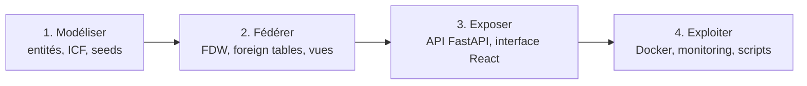
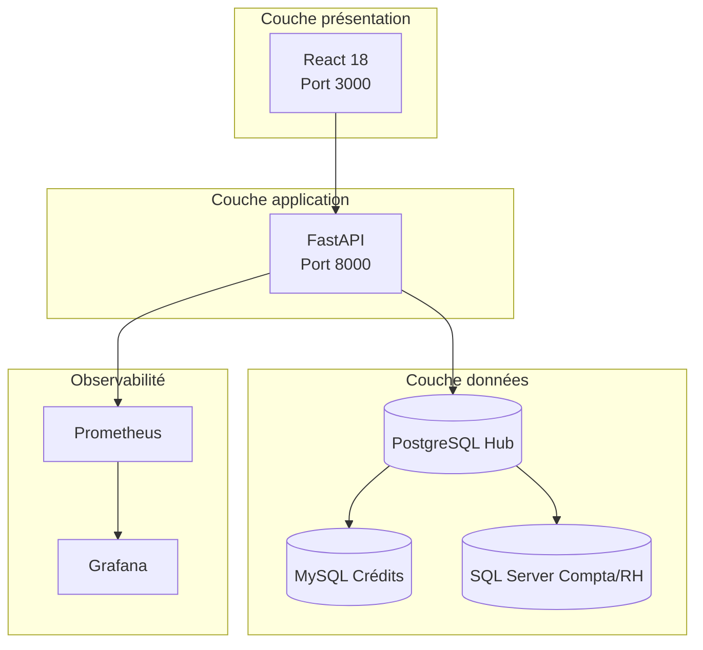
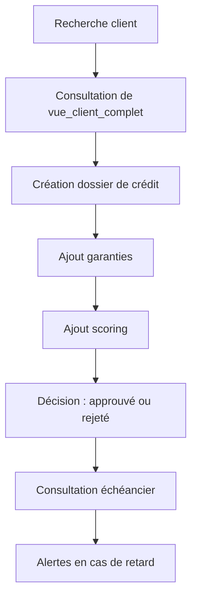
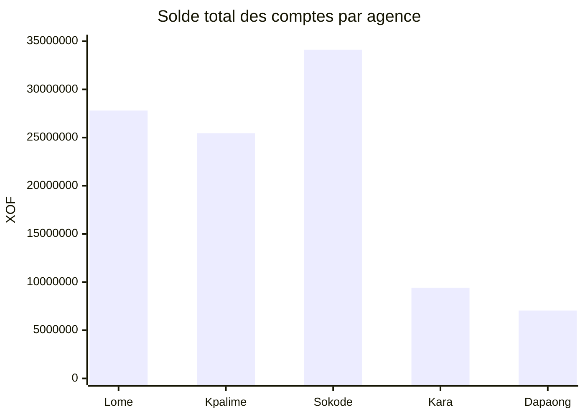
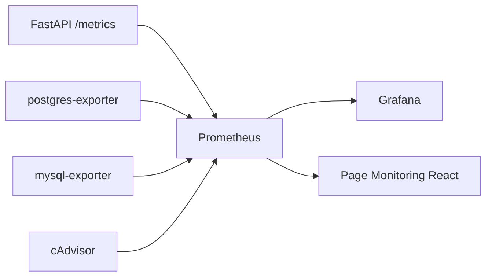
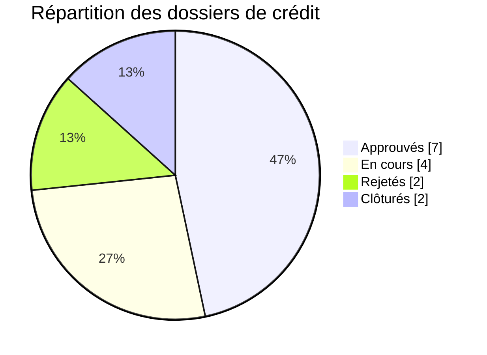
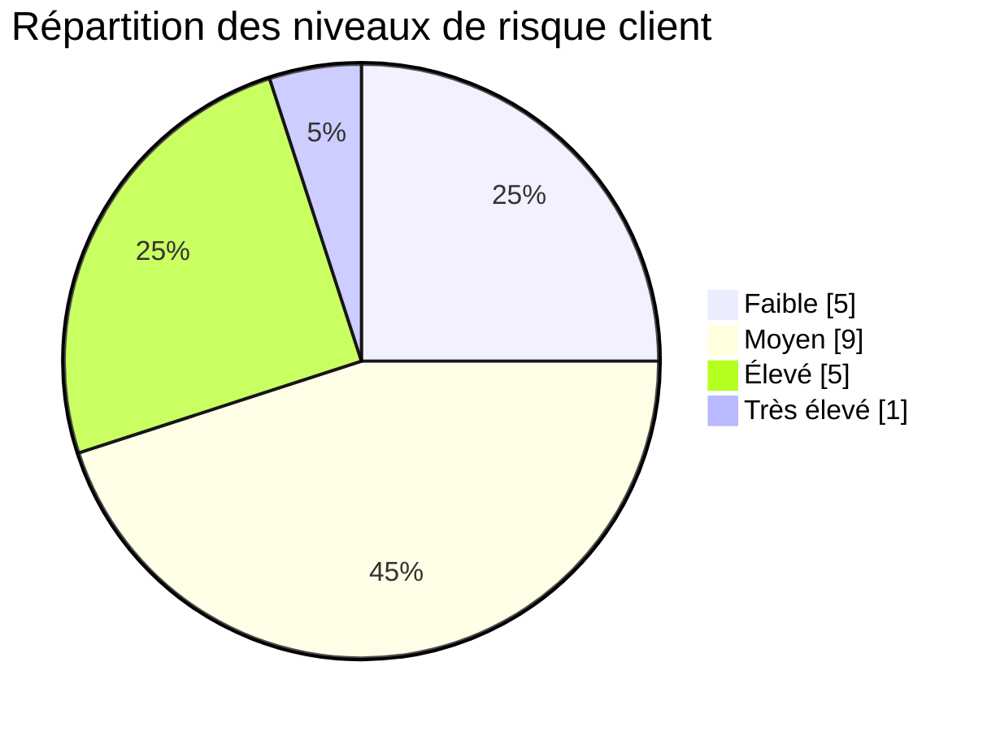
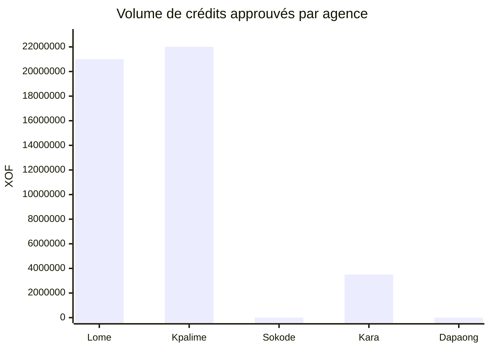
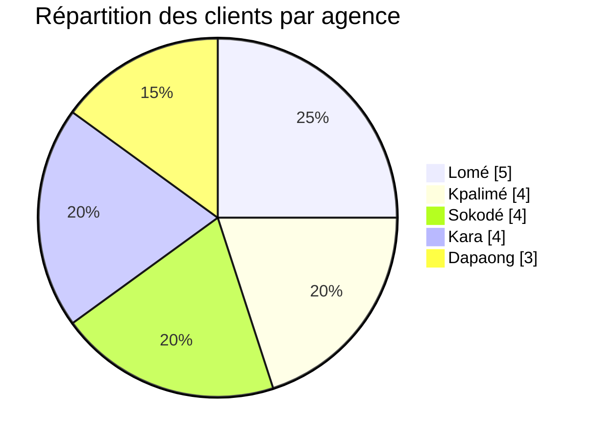

# FedBank Togo

**Système de Bases de Données Fédérées**  
*Une vue unifiée sur les clients, les crédits et la comptabilité sans migration destructive*

> **Projet académique** · Université de Lomé · UE DBA · Soutenance technique et métier

---

## Pitch en 60 secondes

La banque exploitait trois silos de données hétérogènes :

- **PostgreSQL** pour les clients, comptes et transactions
- **MySQL** pour les crédits, garanties, échéanciers et le scoring
- **SQL Server** pour la comptabilité OHADA, la paie et les opérations d'agence

Le projet **FedBank Togo** ne remplace pas ces systèmes. Il les **fédère**.

Le choix clé consiste à utiliser **PostgreSQL comme hub de lecture**, connecté à MySQL et SQL Server via **Foreign Data Wrappers**. Au-dessus, un **backend FastAPI** expose une API unique et un **frontend React** fournit une interface en français, complétée par une brique de **monitoring Prometheus/Grafana**.

**Message central à faire passer au jury** : nous avons démontré qu'une organisation bancaire peut obtenir une vue transverse fiable et exploitable **sans big bang migration**, tout en gardant l'autonomie de ses bases métiers.

---

## Messages Clés Pour Le Jury

1. Le projet résout un **problème réel d'intégration** et pas seulement un exercice de CRUD.
2. La fédération SQL via FDW apporte une **valeur immédiate** : vues 360°, reporting transverse, réconciliation.
3. L'architecture est **techniquement crédible** : Docker, health checks, monitoring, tests async, journal d'erreurs.
4. Le prototype est **honnête sur ses limites** : pas de 2PC, pas encore de JWT/RBAC, pas de tests E2E frontend.
5. Le livrable est **riche en preuves** : 3 SGBD, 10 conteneurs, 8 foreign tables, 4 vues fédérées, 2 vues matérialisées, 12 tests backend, 15 erreurs documentées et résolues.

---

## Sommaire

| # | Section |
|---|---------|
| 1 | [Page de garde](#slide-1--page-de-garde) |
| 2 | [Plan de la soutenance](#slide-2--plan-de-la-soutenance) |
| 3 | [Contexte métier](#slide-3--contexte-métier) |
| 4 | [Problème à résoudre](#slide-4--problème-à-résoudre) |
| 5 | [Objectifs du projet](#slide-5--objectifs-du-projet) |
| 6 | [Démarche de mise en œuvre](#slide-6--démarche-de-mise-en-œuvre) |
| 7 | [Alternatives étudiées](#slide-7--alternatives-étudiées) |
| 8 | [Solution retenue](#slide-8--solution-retenue) |
| 9 | [Valeur métier](#slide-9--valeur-métier) |
| 10 | [Déploiement et architecture runtime](#slide-10--déploiement-et-architecture-runtime) |
| 11 | [Couche données](#slide-11--couche-données) |
| 12 | [Couche application](#slide-12--couche-application) |
| 13 | [Fonctionnalités](#slide-13--fonctionnalités) |
| 14 | [Parcours utilisateur](#slide-14--parcours-utilisateur) |
| 15 | [Observabilité](#slide-15--observabilité) |
| 16 | [Synthèse des difficultés](#slide-16--synthèse-des-difficultés) |
| 17 | [Erreurs Docker et infrastructure](#slide-17--erreurs-docker-et-infrastructure) |
| 18 | [Erreurs FDW et fédération](#slide-18--erreurs-fdw-et-fédération) |
| 19 | [Erreurs application et données](#slide-19--erreurs-application-et-données) |
| 20 | [Leçons apprises](#slide-20--leçons-apprises) |
| 21 | [Résultats mesurables](#slide-21--résultats-mesurables) |
| 22 | [Sécurité et conformité](#slide-22--sécurité-et-conformité) |
| 23 | [Qualité et validation](#slide-23--qualité-et-validation) |
| 24 | [Limites et perspectives](#slide-24--limites-et-perspectives) |
| 25 | [Conclusion](#slide-25--conclusion) |

**Annexes** : [plan de démo](#annexe-a--plan-de-démo-5-min) · [questions du jury](#annexe-b--questions-probables-du-jury) · [commandes utiles](#annexe-c--commandes-utiles)

---

<!-- SLIDE 1 -->

## Slide 1 — Page de garde

### Titre à afficher

**FedBank Togo**  
Système de Bases de Données Fédérées pour une banque commerciale togolaise

### À dire

Ce projet traite un problème classique mais critique dans les SI bancaires : les données essentielles au métier sont réparties dans plusieurs bases, plusieurs technologies et plusieurs équipes. Nous avons construit une plateforme qui les fédère et les rend exploitables à travers une API unique, une interface web et des outils de supervision.

### Chiffres d'ouverture

| Élément | Valeur |
|---------|--------|
| SGBD fédérés | PostgreSQL 16, MySQL 8.0, SQL Server 2022 |
| Stack applicative | FastAPI, React 18, Tailwind 4 |
| Conteneurisation | 10 services Docker |
| Domaine métier | Banque, crédits, comptabilité OHADA, paie |

### Transition

Avant de parler technique, il faut comprendre le contexte métier qui justifie ce choix de fédération.

---

<!-- SLIDE 2 -->

## Slide 2 — Plan de la soutenance

### Structure de l'exposé

1. Contexte bancaire et problème métier
2. Objectifs et alternatives
3. Solution retenue et architecture
4. Données, API, frontend et monitoring
5. Difficultés, erreurs et apprentissages
6. Résultats, qualité, limites et perspectives

### Conseil oral

Présenter ce plan comme une progression logique :

- d'abord **pourquoi** le projet existe
- ensuite **comment** nous l'avons construit
- enfin **ce que cela prouve** techniquement et métier

---

<!-- SLIDE 3 -->

## Slide 3 — Contexte métier

### Banque du Togo : périmètre de démonstration

- **5 agences** : Lomé, Kpalimé, Sokodé, Kara, Dapaong
- **20 clients** seedés dans PostgreSQL
- **30 comptes** bancaires
- **15 dossiers de crédit**
- **120 écritures comptables** SQL Server
- **50 opérations agence** et **20 bulletins de paie**

### Répartition des responsabilités par SGBD

| Système | SGBD | Responsabilité |
|---------|------|----------------|
| Core banking | PostgreSQL | clients, agences, comptes, transactions |
| Gestion du crédit | MySQL | dossiers, garanties, échéanciers, scoring |
| Comptabilité / RH | SQL Server | plan OHADA, écritures, paie, opérations agence |

### Message à porter

Le projet n'invente pas artificiellement la complexité : il reproduit un paysage applicatif très crédible, avec des domaines métier séparés par héritage technique et organisationnel.

---

<!-- SLIDE 4 -->

## Slide 4 — Problème à résoudre

### Symptômes observés

| Symptôme | Conséquence métier |
|----------|--------------------|
| Données en silos | impossibilité de croiser solde, risque et crédit dans une seule requête |
| Vision client fragmentée | pas de fiche 360° pour le conseiller |
| Réconciliation manuelle | doublons, incohérences, lenteur de contrôle |
| Reporting éclaté | consolidation manuelle de plusieurs exports |
| Décision crédit lente | consultation de plusieurs applications successives |

### Formulation simple du besoin

La banque a besoin d'une **vue transverse temps quasi réel** sans devoir arrêter ses systèmes existants ni migrer massivement ses données.

### Phrase forte

Le problème n'est pas seulement l'accès aux données ; c'est l'absence de **connaissance consolidée** pour la décision.

---

<!-- SLIDE 5 -->

## Slide 5 — Objectifs du projet

### Objectif général

Concevoir un système fédéré permettant d'exploiter ensemble trois bases hétérogènes tout en conservant l'autonomie de chaque source.

### Objectifs opérationnels

1. Exposer une **API REST unique** pour les usages métier et techniques.
2. Construire des **vues SQL fédérées** utiles au quotidien.
3. Fournir une **interface web** française, exploitable en démonstration.
4. Mettre en place une **réconciliation ICF** entre plusieurs domaines.
5. Ajouter une **observabilité** de l'infrastructure et de l'API.

### Critères de réussite

| Critère | Preuve dans le projet |
|---------|-----------------------|
| Fédération fonctionnelle | 8 foreign tables et 4 vues fédérées |
| Vision transverse | `vue_client_complet`, `vue_credit_detail`, `vue_tableau_bord` |
| Exploitabilité | FastAPI + React + Swagger |
| Robustesse démo | Docker Compose + health checks + scripts de vérification |
| Traçabilité | `RAPPORT_ERREURS.md` et module de réconciliation |

---

<!-- SLIDE 6 -->

## Slide 6 — Démarche de mise en œuvre

### Méthode en 4 phases



### Correspondance phase / livrable

| Phase | Livrable concret | Référence dépôt |
|-------|------------------|-----------------|
| Modélisation | schémas et données de démo | `postgres-hub/init`, `mysql-credit/init`, `mssql-compta/init` |
| Fédération | serveurs FDW, foreign tables, vues, MV | `postgres-hub/fdw-init/` |
| Exposition | routeurs, services, pages React | `backend/app`, `frontend/src` |
| Exploitation | Docker, Prometheus, Grafana, scripts | `docker-compose.yml`, `prometheus/`, `grafana/`, `scripts/` |

### Message à dire

Nous n'avons pas construit un POC isolé ; nous avons construit une chaîne complète, de la donnée brute jusqu'à la supervision.

---

<!-- SLIDE 7 -->

## Slide 7 — Alternatives étudiées

| Option | Atout principal | Limite principale | Verdict |
|--------|-----------------|------------------|---------|
| Migration vers un SGBD unique | simplification long terme | coût élevé, risque fort, rupture métier | non retenu |
| ETL batch / entrepôt | intégration simplifiée | données non fraîches, faible interactivité | non retenu |
| Microservices seulement | découplage applicatif | pas de jointures SQL natives entre domaines | partiellement utile |
| Linked Server SQL Server | solution centrée Microsoft | moins cohérent comme hub global | non retenu |
| **PostgreSQL + FDW** | jointures SQL, temps quasi réel, hub clair | complexité FDW et tuning | **retenu** |

### Justification stratégique

La fédération par FDW est le meilleur compromis entre :

- **réalisme technique**
- **coût de mise en œuvre**
- **valeur métier immédiate**

---

<!-- SLIDE 8 -->

## Slide 8 — Solution retenue

### Architecture logique



### Principe d'architecture

- **PostgreSQL** joue le rôle de hub fédéré
- **MySQL** et **SQL Server** restent sources de vérité dans leur domaine
- **FastAPI** centralise la logique de lecture, d'écriture et de santé système
- **React** fournit les parcours métier et techniques
- **Prometheus / Grafana** rendent le tout observable

### Message à dire

Le choix central n'est pas seulement PostgreSQL. Le vrai choix est : **où placer la cohérence de lecture**. Nous l'avons placée au niveau du hub fédéré.

---

<!-- SLIDE 9 -->

## Slide 9 — Valeur métier

### Valeur par profil utilisateur

| Profil | Ce que le système apporte |
|--------|---------------------------|
| Directeur d'agence | KPIs consolidés par agence |
| Responsable crédit | vue client + scoring + dossier + échéancier |
| Contrôleur / comptable | rapprochement entre transactions et écritures OHADA |
| RH | consultation paie et opérations par agence |
| DBA / support | santé FDW, vues, console SQL de lecture, monitoring |

### Exemples de gains

- un **client** peut être consulté avec son solde, son nombre de comptes et son niveau de risque
- un **dossier de crédit** peut être enrichi par les garanties et l'échéancier
- une **agence** peut être pilotée avec comptes, crédits et volume d'opérations

### Formule synthèse

Le projet transforme des données séparées en **capacité de décision**.

---

<!-- SLIDE 10 -->

## Slide 10 — Déploiement et architecture runtime

### 10 conteneurs Docker

| Couche | Service | Port hôte | Rôle |
|--------|---------|-----------|------|
| UI | `react-frontend` | 3000 | interface React |
| API | `fastapi-backend` | 8000 | API REST + `/metrics` |
| Données | `postgres-hub` | 5435 | hub PostgreSQL + FDW |
| Données | `mysql-credit` | 3308 | domaine crédits |
| Données | `mssql-compta` | 1435 | domaine compta / RH |
| Monitoring | `prometheus` | 9090 | collecte des métriques |
| Monitoring | `grafana` | 3001 | dashboards |
| Exporter | `postgres-exporter` | 9187 | métriques PostgreSQL |
| Exporter | `mysql-exporter` | 9104 | métriques MySQL |
| Infra | `cadvisor` | 8081 | métriques conteneurs |

### Points de robustesse

- `depends_on` avec `condition: service_healthy`
- health checks dédiés pour PostgreSQL, MySQL, SQL Server et backend
- réseau Docker unique `reseau-banque`
- ports hôtes non standards pour éviter les conflits locaux

### Message à dire

La démonstration n'est pas un assemblage manuel. Elle est **rejouable** et **industrialise la démo**.

---

<!-- SLIDE 11 -->

## Slide 11 — Couche données

### Tables locales dans PostgreSQL

| Table | Lignes | Rôle |
|-------|--------|------|
| `agence` | 5 | agences bancaires |
| `employe` | 10 | personnel |
| `client` | 20 | référentiel client + ICF |
| `compte` | 30 | comptes courant, épargne, terme |
| `transaction` | 104 | opérations bancaires |

### Tables distantes exposées via FDW

| Source | Foreign tables | Volume |
|--------|----------------|--------|
| MySQL | `fdw_dossier_credit`, `fdw_garantie`, `fdw_echeancier`, `fdw_scoring` | 15, 20, 50, 20 |
| SQL Server | `fdw_ecriture_comptable`, `fdw_plan_comptable`, `fdw_bulletin_paie`, `fdw_operation_agence` | 120, 60, 20, 50 |

### Vues fédérées

| Vue | Apport |
|-----|--------|
| `vue_client_complet` | fiche 360° client avec scoring et soldes |
| `vue_credit_detail` | dossier enrichi avec garanties et échéancier |
| `vue_operation_comptable` | transaction rapprochée d'une écriture comptable |
| `vue_tableau_bord` | indicateurs consolidés par agence |

### Vues matérialisées

- `mv_tableau_bord`
- `mv_clients_risque_eleve`

### ICF : identifiant de réconciliation

```text
ICF = SHA-256(numero_piece + "TOGO_BK001")
```

L'ICF fait exactement **64 caractères hexadécimaux** et sert de pivot entre domaines sans exposer directement la pièce d'identité.

---

<!-- SLIDE 12 -->

## Slide 12 — Couche application

### Backend FastAPI

| Bloc | Rôle |
|------|------|
| `main.py` | startup, shutdown, CORS, santé, métriques Prometheus |
| `routers/` | 9 routeurs métier |
| `services/` | logique métier, fédération, alertes, réconciliation |
| `database.py` | moteurs async PostgreSQL et MySQL |
| `utils/icf_generator.py` | génération ICF SHA-256 |

### Fonctionnement notable

- stack **asynchrone** avec `asyncpg` et `aiomysql`
- usage de `sqlalchemy.text()` pour les requêtes SQL
- endpoint santé global : `GET /api/health`
- endpoint état de fédération : `GET /api/federation/status`
- endpoint SQL de lecture : `POST /api/database/query`

### Frontend React

- **17 routes / écrans**
- navigation métier + formulaires + pages techniques
- page dédiée au **monitoring Prometheus**
- interface intégralement en **français**

### Message à dire

L'application n'est pas un simple viewer SQL : elle expose de vrais parcours métier, tout en gardant une couche technique visible pour l'exploitation.

---

<!-- SLIDE 13 -->

## Slide 13 — Fonctionnalités

| Module | Ce qu'il fait | Intérêt |
|--------|---------------|---------|
| Dashboard | KPIs par agence, vues matérialisées, risques élevés | pilotage |
| Clients | liste, filtres, fiche détaillée, création avec ICF | connaissance client |
| Comptes | consultation, statistiques, historique transactions | activité bancaire |
| Crédits | dossier, décision, garanties, scoring, échéancier | cycle crédit |
| Alertes | soldes bas, retards, transactions suspectes | prévention |
| Réconciliation | rapport ICF, doublons, cohérence comptes/crédits | qualité des données |
| Fédération | statut des serveurs FDW et vues | supervision |
| Database | vue d'ensemble des 3 SGBD + requêtes de lecture | outil DBA |
| Monitoring | métriques Prometheus en interface | observabilité |

### Détails utiles au jury

- seuil par défaut **solde bas** : `50 000 XOF`
- seuil **transaction suspecte** : `5 000 000 XOF`
- les clients à risque élevé sont alimentés par la vue matérialisée dédiée

### Ce que la visite réelle des pages montre

| Page visitée | Ce qui ressort visuellement | Ce que cela prouve |
|--------------|-----------------------------|--------------------|
| Dashboard | 5 cartes KPI, 2 graphiques, 1 tableau de synthèse, 1 panneau risque | la fédération produit une vraie lecture métier |
| Clients | filtres combinés, tableau dense, ICF tronqué, badges de risque | la vue `vue_client_complet` est bien exploitable côté agence |
| Credits | filtre par statut, montants, garanties, échéances impayées | le parcours crédit est crédible et lisible |
| Federation | statuts connectés, 8 foreign tables, 4 vues actives | excellente page pour expliquer les FDW au jury |
| Database | versions, tailles, connexions, vues matérialisées, onglets DBA | le projet va au-delà du simple CRUD |
| Reconciliation | statut cohérent, volumes ICF, contrôle transverse | l'intégration inter-bases est mesurable |
| Alertes | synthèse riche, mais liste perfectible | bonne idée produit, finition UI encore à consolider |
| Monitoring | vraie ambition observabilité, mais dépendance forte à Prometheus | bon point fort, avec dette d'intégration frontend |

---

<!-- SLIDE 14 -->

## Slide 14 — Parcours utilisateur

### Scénario 1 : responsable crédit



### Scénario 2 : directeur d'agence

- ouverture du dashboard
- lecture des indicateurs consolidés par agence
- focus sur les clients à risque élevé
- comparaison volume des comptes, crédits et opérations

### Scénario 3 : DBA / support

- contrôle de l'état des FDW
- vérification des compteurs santé
- exécution d'une requête de lecture sur PostgreSQL ou MySQL

### Graphique issu du dashboard : soldes par agence



### Lecture du graphique

- **Sokodé** porte le plus gros volume de soldes sur le jeu de démonstration
- **Lomé** concentre une part importante des comptes et du volume crédit
- **Dapaong** ressort comme un point d'attention métier : peu de comptes, plusieurs profils à risque élevé

### Message à dire

Nous avons conçu le projet autour de **parcours d'usage**, pas autour de tables isolées.

---

<!-- SLIDE 15 -->

## Slide 15 — Observabilité

### Ce qui est mesuré

| Source | Indicateurs suivis |
|--------|--------------------|
| FastAPI | volume de requêtes, latence, erreurs, statut santé |
| Backend custom | `db_connections_active`, `db_queries_total`, `db_query_duration_seconds`, `fdw_connection_status` |
| PostgreSQL exporter | connexions, taille, activité |
| MySQL exporter | connexions, état moteur |
| cAdvisor | CPU, mémoire, conteneurs |

### Chaîne de supervision



### Faits précis

- intervalle de scrape Prometheus : **15 secondes**
- page `MonitoringPage.jsx` interroge directement l'API Prometheus
- Grafana est pré-provisionné dans `grafana/provisioning/`

### Graphique issu de la page Credits : répartition des statuts



### Graphique issu des clients : niveaux de risque



### Lecture produit

- le jeu de démonstration est **assez varié** pour nourrir une soutenance riche
- le portefeuille est majoritairement **moyen risque**
- les cas **élevés / très élevés** justifient bien la présence du dashboard risque, de la réconciliation et des alertes

### Message à dire

Pour un projet académique, l'observabilité est un vrai différenciateur : nous ne montrons pas seulement que le système fonctionne, nous montrons aussi **comment on le surveille**.

---

<!-- SLIDE 16 -->

## Slide 16 — Synthèse des difficultés

### Bilan

**15 erreurs identifiées, 15 résolues, 0 bloquante au dernier état documenté.**

### Répartition

| Catégorie | Volume |
|-----------|--------|
| Docker / infrastructure | 3 |
| PostgreSQL / FDW | 3 |
| MySQL | 2 |
| SQL Server | 2 |
| Backend FastAPI | 2 |
| Frontend React | 1 |
| Fédération / vues | 1 |
| Données / seed | 1 |

### Lecture à donner au jury

Le rapport d'erreurs n'est pas un aveu de faiblesse. C'est une preuve de maturité de projet :

- les incidents sont **datés**
- les causes racines sont **explicitées**
- les corrections sont **reproductibles**

---

<!-- SLIDE 17 -->

## Slide 17 — Erreurs Docker et infrastructure

| ID | Problème | Cause racine | Correction |
|----|----------|--------------|------------|
| ERR-001 | `chmod` impossible dans l'image MSSQL | `USER mssql` appliqué trop tôt | déplacer `USER mssql` après `COPY` et `chmod` |
| ERR-003 | conflits de ports hôtes | services locaux déjà actifs | ports 5435, 3308, 1435 |
| ERR-005 | DNS inter-conteneurs cassé | réseau Docker incohérent après redémarrage partiel | `docker compose down && up` |
| ERR-008 | bases vides au premier démarrage | séquences d'init incomplètes | seeds dans les images + initialisation différée |

### Message à dire

Nous avons traité très tôt les problèmes de reproductibilité, ce qui a stabilisé tout le reste du projet.

---

<!-- SLIDE 18 -->

## Slide 18 — Erreurs FDW et fédération

| ID | Problème | Réponse apportée |
|----|----------|------------------|
| ERR-004 | `dbname` invalide dans `mysql_fdw` côté serveur | déplacer `dbname` au niveau de chaque foreign table |
| ERR-009 | FDW disparus après réinitialisation | `post-init.sh` et wrapper d'entrypoint |
| ERR-014 | dates SQL Server retournées en texte | `VARCHAR(30)` dans la foreign table puis `TO_DATE()` dans les vues |

### Exemple technique fort

```sql
TO_DATE(ec.date_ecriture, 'Mon DD YYYY HH12:MI:SS:AM')
```

### Pourquoi cette slide compte

Elle prouve que le travail de fédération ne s'est pas limité à "connecter des bases" ; il a fallu gérer la **sémantique des données** et les particularités de chaque moteur.

---

<!-- SLIDE 19 -->

## Slide 19 — Erreurs application et données

| Couche | Point marquant | Solution |
|--------|----------------|----------|
| Backend | `pool_pre_ping` incompatible avec les drivers async | suppression de `pool_pre_ping` |
| Tests | config asyncio incomplète | `pytest.ini` avec `asyncio_mode = auto` |
| Frontend | backend injoignable depuis l'UI | `VITE_API_URL=http://localhost:8000/api` |
| Seeds | ICF de 65 caractères | normalisation à 64 caractères |
| SQL Server | contrainte `montant > 0` cassée par le seed | correction des montants |
| PostgreSQL | réinitialisation d'identités | `TRUNCATE ... RESTART IDENTITY CASCADE` |

### Message à dire

Une grande partie de la qualité finale vient du traitement rigoureux des détails : configuration, idempotence, conventions de longueur, compatibilités de drivers.

---

<!-- SLIDE 20 -->

## Slide 20 — Leçons apprises

### Enseignements techniques

| Sujet | Leçon |
|-------|-------|
| FDW | la connectivité n'est que le début ; le vrai sujet est l'alignement des formats |
| Docker | l'ordre de build et les health checks changent la fiabilité d'une démo |
| Asynchrone | certains réflexes SQLAlchemy sync ne se transportent pas en async |
| Données seed | l'idempotence facilite énormément les itérations |
| Monitoring | mesurer tôt aide à expliquer et défendre l'architecture |

### Enseignements projet

- documenter les erreurs au fil de l'eau réduit le coût de correction
- la fédération donne vite de la valeur si les vues sont pensées autour des usages
- un bon projet de DBA doit aussi montrer l'**exploitabilité** du système

---

<!-- SLIDE 21 -->

## Slide 21 — Résultats mesurables

| Indicateur | Valeur vérifiée dans le dépôt |
|------------|-------------------------------|
| SGBD hétérogènes fédérés | 3 |
| Conteneurs Docker | 10 |
| Foreign tables | 8 |
| Vues fédérées | 4 |
| Vues matérialisées | 2 |
| Routeurs métier FastAPI | 9 |
| Endpoints système additionnels | santé + fédération |
| Écrans / routes React | 17 |
| Tests backend | 12 |
| Erreurs résolues | 15 / 15 |

### Résultats visibles à l'écran

| Élément observé dans l'application | Valeur |
|------------------------------------|--------|
| Comptes actifs affichés au dashboard | 30 |
| Solde total global affiché | 103 850 000 XOF |
| Crédits approuvés affichés | 7 |
| Volume total de crédits affiché | 46 500 000 XOF |
| Agences visibles au dashboard | 5 |
| Clients visibles dans la liste | 20 |
| Dossiers de crédit visibles | 15 |
| Alertes de retard dans le résumé | 18 |
| Serveurs FDW affichés comme connectés | 2 distants + 1 hub |

### Preuves de démonstration

```bash
docker compose up -d --build
docker exec fastapi-backend pytest -v
./scripts/verify-all.sh
```

### Message à dire

Le projet est démontrable, chiffrable et vérifiable. C'est un point fort important pour la soutenance.

---

<!-- SLIDE 22 -->

## Slide 22 — Sécurité et conformité

### Ce qui est en place

| Mesure | Détail |
|--------|--------|
| Pseudonymisation | ICF SHA-256 pour éviter l'usage direct de la pièce d'identité comme clé d'intégration |
| Cloisonnement | réseau Docker dédié |
| Limitation SQL | endpoint `/api/database/query` limité aux requêtes de lecture |
| Contexte comptable | données et terminologie alignées sur OHADA |
| Langue métier | interface et documentation en français |

### Ce qui n'est pas encore en place

- pas de **JWT**
- pas de **RBAC**
- pas de chiffrement avancé des secrets au-delà de `.env`

### Positionnement honnête

Le prototype est **sécurisé pour une démonstration contrôlée**, mais pas encore durci au niveau attendu d'une production bancaire.

---

<!-- SLIDE 23 -->

## Slide 23 — Qualité et validation

### Tests backend présents

| Fichier | Nombre de tests | Ce qui est validé |
|---------|-----------------|-------------------|
| `test_clients.py` | 4 | liste, recherche, création, absence |
| `test_credits.py` | 3 | liste, filtre statut, détail |
| `test_federation.py` | 4 | santé, statut FDW, vues |
| `test_reconciliation.py` | 1 | cohérence ICF |
| **Total** | **12** | backend critique |

### Autres mécanismes de validation

- `scripts/verify-all.sh` pour la vérification globale
- `scripts/reconcile.sh` pour la cohérence inter-bases
- Swagger pour l'inspection rapide de l'API
- vues matérialisées rafraîchissables à la demande

### Limite assumée

Il n'existe pas encore de tests E2E frontend de type Playwright ou Cypress.

---

<!-- SLIDE 24 -->

## Slide 24 — Limites et perspectives

### Limites actuelles

| Limite | Effet |
|--------|-------|
| Pas d'authentification / autorisation | projet limité à un cadre de démonstration |
| Pas de transactions distribuées | cohérence inter-domaines non garantie par 2PC |
| Dates SQL Server textuelles via `tds_fdw` | dette technique sur le mapping |
| Jeu de données modeste | performance à l'échelle non démontrée |
| Pas de tests E2E frontend | risque de régression UI non couvert |

### Limites vues pendant l'exploration de l'interface

| Point observé | Lecture |
|---------------|---------|
| `MonitoringPage` appelle `http://localhost:9090/api/v1` en dur | forte dépendance à l'environnement local, risque d'afficher les mauvais targets |
| `AlertesPage` montre 18 alertes dans le résumé mais une liste vide au filtre par défaut | incohérence probable entre valeur de filtre vide et logique backend |
| certaines pages techniques sont très riches, mais les liens de détail métier restent limités | UX améliorable pour une exploitation quotidienne |
| la supervision frontend dépend de plusieurs services externes | belle ambition, mais couplage plus fragile en environnement non standard |

### Perspectives réalistes

| Horizon | Évolution |
|---------|-----------|
| Court terme | JWT, RBAC, durcissement API |
| Moyen terme | tests E2E, CI/CD, pagination et optimisation FDW |
| Long terme | haute disponibilité du hub PostgreSQL, cache, alerting temps réel |
| Métier | reporting prudentiel, mobile banking, détection avancée de fraude |

### Message à dire

Les limites identifiées sont des **prochaines étapes naturelles**, pas des contradictions de conception.

---

<!-- SLIDE 25 -->

## Slide 25 — Conclusion

### Ce que le projet démontre

- il est possible de **fédérer 3 SGBD hétérogènes** sans migration destructrice
- la fédération peut produire une **valeur métier immédiate**
- une architecture académique peut rester **propre, monitorée et démontrable**
- les difficultés techniques rencontrées ont été **capitalisées**, pas subies

### Formule de clôture

FedBank Togo montre que la fédération n'est pas seulement une technique DBA. C'est une réponse concrète à un patrimoine de données hétérogène dans lequel on cherche de la cohérence, de la visibilité et de la décision.

### Fin

**Merci pour votre attention.**  
Démo : `http://localhost:3000`  
Swagger : `http://localhost:8000/docs`

---

## Annexe A — Plan De Démo 5 Min

### Démo recommandée

1. Ouvrir le **dashboard** pour montrer la consolidation multi-sources.
2. Aller sur **Clients** puis ouvrir une fiche pour illustrer `vue_client_complet`.
3. Aller sur **Crédits** puis ouvrir un dossier pour montrer la fédération avec MySQL.
4. Afficher la page **Fédération** pour prouver la connexion aux FDW.
5. Terminer sur **Monitoring** ou Grafana pour montrer l'exploitabilité.

### Ce que la démo doit prouver

- la donnée remonte réellement de plusieurs systèmes
- le projet n'est pas un mock frontend
- l'architecture est observable

---

## Annexe B — Questions Probables Du Jury

### Pourquoi ne pas tout migrer vers PostgreSQL ?

Parce qu'une migration totale est plus coûteuse, plus risquée et moins réaliste dans un SI bancaire hétérogène. Ici, nous cherchons une valeur rapide sans rupture.

### Pourquoi PostgreSQL comme hub ?

Pour sa maturité sur les FDW, sa capacité à exposer des vues fédérées lisibles et le fait qu'il peut agréger les données sans imposer un changement sur les bases sources.

### Quelles sont les limites de la solution ?

Pas de transaction distribuée, besoin de vigilance sur les performances FDW et sécurité encore limitée à une démo contrôlée.

### Quelle preuve avez-vous que le système est fiable ?

Health checks, monitoring Prometheus/Grafana, 12 tests backend, scripts de vérification et 15 incidents documentés puis résolus.

### En quoi le projet est-il original ?

L'originalité tient à la combinaison de plusieurs dimensions rarement réunies dans un même projet académique : 3 SGBD réels, FDW, vue métier, monitoring, réconciliation et interface utilisateur.

---

## Annexe C — Commandes Utiles

```bash
# Démarrage / arrêt
docker compose up -d --build
docker compose down

# Logs
docker compose logs -f fastapi-backend
docker compose logs -f postgres-hub

# Vérification
docker exec fastapi-backend pytest -v
./scripts/verify-all.sh
./scripts/reconcile.sh

# Accès
# Frontend :  http://localhost:3000
# Swagger  :  http://localhost:8000/docs
# Grafana  :  http://localhost:3001
# Prometheus : http://localhost:9090
```

---

## Annexe D — Documents Associés

| Fichier | Usage |
|---------|-------|
| [README.md](./README.md) | index du dossier présentation |
| [documentation_projet.md](./documentation_projet.md) | référence technique détaillée |
| [analyse_critique.md](./analyse_critique.md) | forces, limites et lecture critique |
| [../RAPPORT_ERREURS.md](../RAPPORT_ERREURS.md) | journal détaillé des incidents |
| [../09_PRESENTATION_DIAGRAMMES.md](../09_PRESENTATION_DIAGRAMMES.md) | diagrammes Mermaid complémentaires |

---

## Annexe E — Galerie De Graphiques

### Comptes actifs par agence


### Volume de crédits approuvés par agence



### Répartition des clients par agence



### Lecture rapide

- **Lomé** et **Kpalimé** concentrent le plus de volume crédit
- **Sokodé** porte le plus gros volume de soldes dans le tableau de bord
- **Dapaong** représente un cas intéressant pour la démonstration du risque
