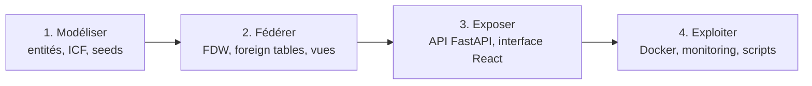
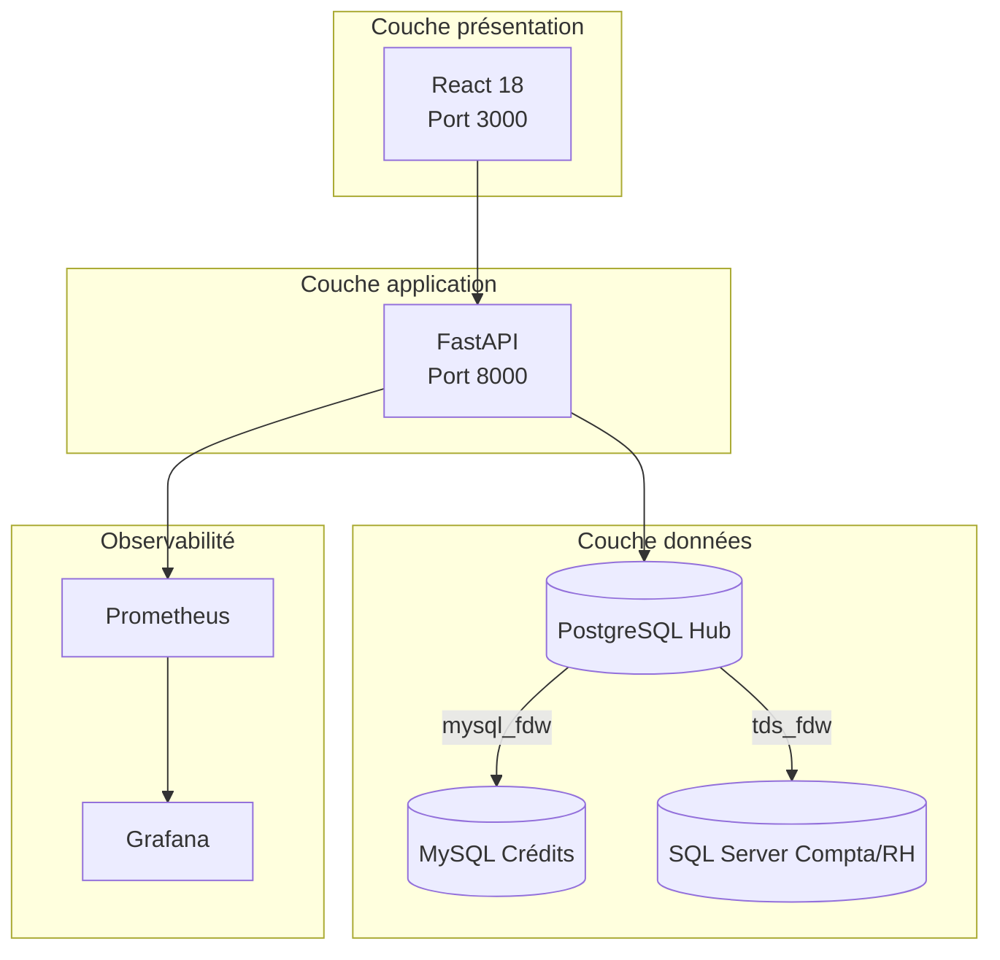
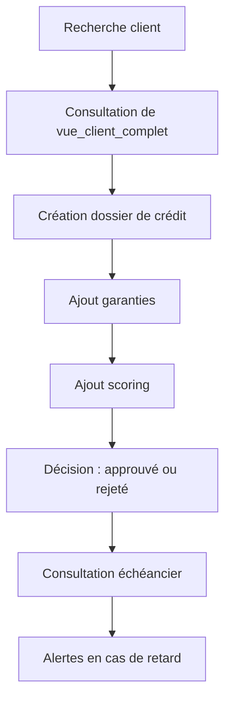
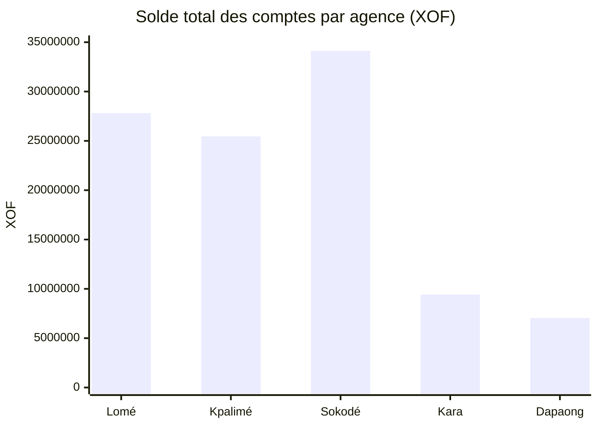
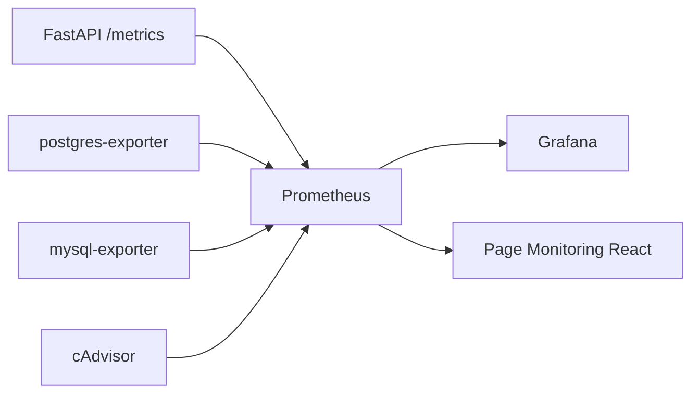
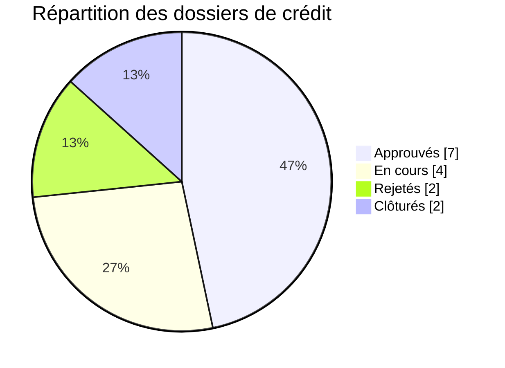
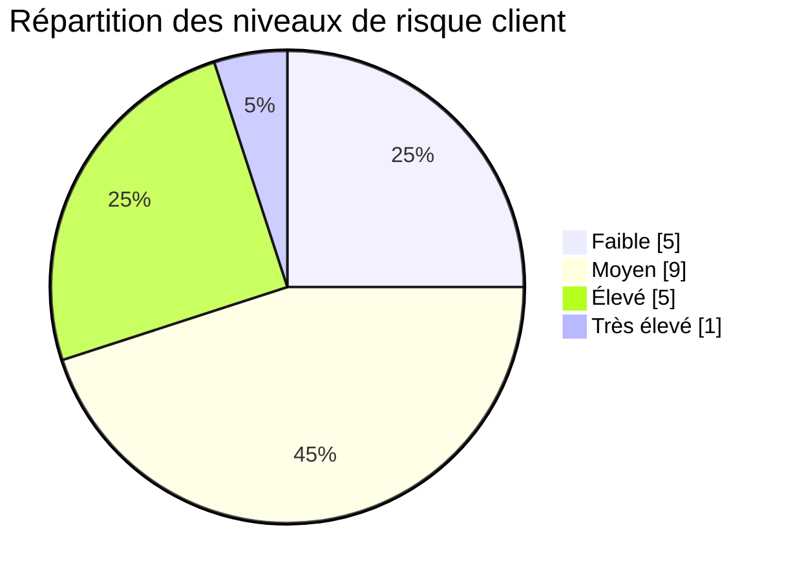
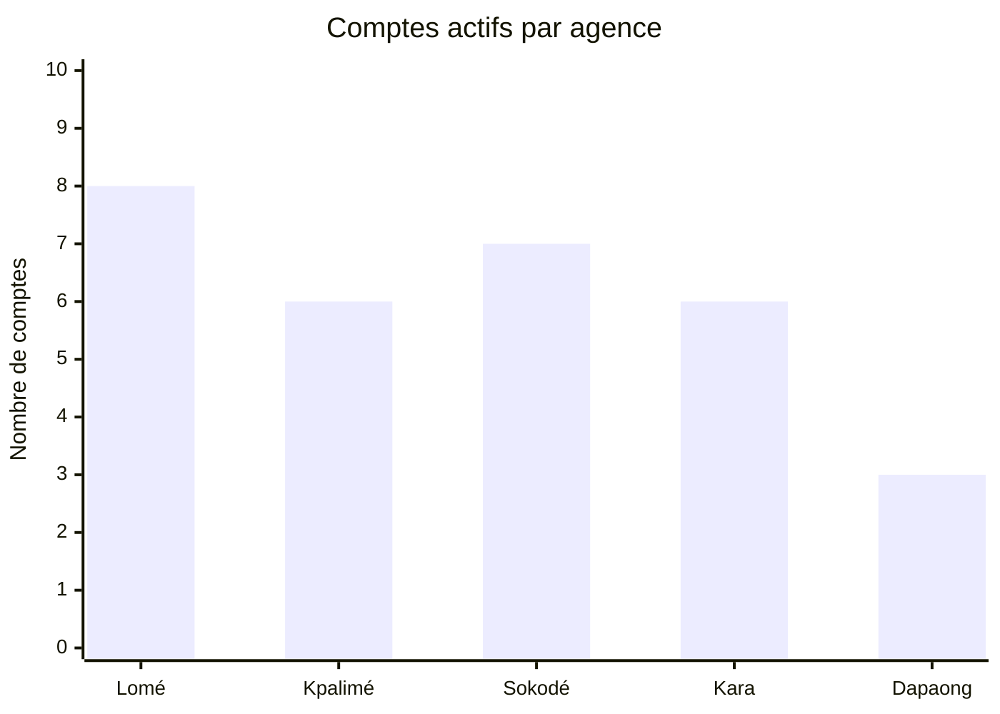
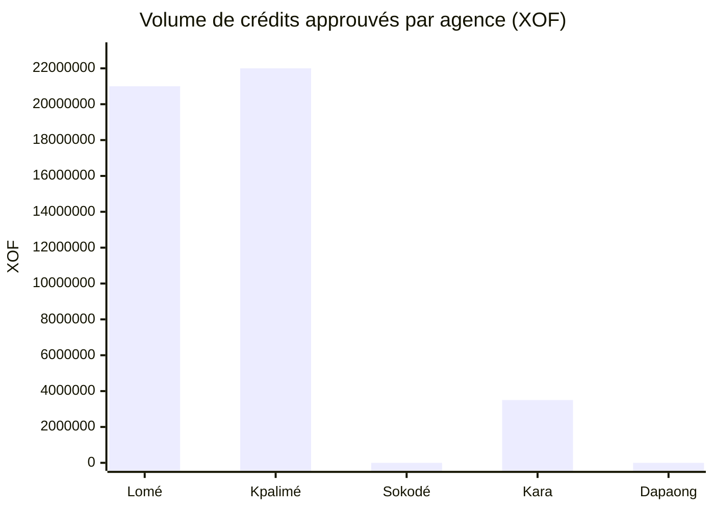
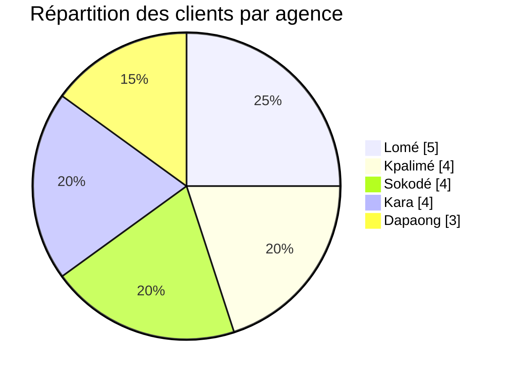

# FedBank Togo
## Système de Bases de Données Fédérées

> *Une vue unifiée sur les clients, les crédits et la comptabilité — sans migration destructive*

**Université de Lomé · UE DBA · Soutenance technique et métier · Mai 2026**

---

## 🎯 Pitch en 60 secondes

La banque exploitait trois silos de données hétérogènes :

| Système | SGBD | Périmètre |
|---------|------|-----------|
| Core banking | **PostgreSQL** | Clients, comptes, transactions |
| Gestion du crédit | **MySQL** | Crédits, garanties, échéanciers, scoring |
| Comptabilité / RH | **SQL Server** | OHADA, écritures, paie, opérations d'agence |

**FedBank Togo ne remplace pas ces systèmes. Il les fédère.**

Le choix clé : utiliser **PostgreSQL comme hub de lecture**, connecté à MySQL et SQL Server via **Foreign Data Wrappers**. Au-dessus, un **backend FastAPI** expose une API unique et un **frontend React** fournit une interface en français, complétée par une brique **Prometheus / Grafana**.

> 💡 **Message central :** une organisation bancaire peut obtenir une vue transverse fiable et exploitable **sans big bang migration**, tout en gardant l'autonomie de ses bases métiers.

---

## ✅ Messages clés pour le jury

1. Le projet résout un **problème réel d'intégration** — pas seulement un exercice de CRUD.
2. La fédération SQL via FDW apporte une **valeur immédiate** : vues 360°, reporting transverse, réconciliation.
3. L'architecture est **techniquement crédible** : Docker, health checks, monitoring, tests async, journal d'erreurs.
4. Le prototype est **honnête sur ses limites** : pas de 2PC, pas encore de JWT/RBAC, pas de tests E2E frontend.
5. Le livrable est **riche en preuves** : 3 SGBD · 10 conteneurs · 8 foreign tables · 4 vues fédérées · 2 vues matérialisées · 12 tests backend · **15 erreurs documentées et résolues**.

---

## 📋 Sommaire — 25 diapositives

| # | Section | Thème |
|---|---------|-------|
| 1 | [Page de garde](#slide-1--page-de-garde) | Introduction |
| 2 | [Plan de la soutenance](#slide-2--plan-de-la-soutenance) | Cadrage |
| 3 | [Contexte métier](#slide-3--contexte-métier) | Pourquoi |
| 4 | [Problème à résoudre](#slide-4--problème-à-résoudre) | Pourquoi |
| 5 | [Objectifs du projet](#slide-5--objectifs-du-projet) | Pourquoi |
| 6 | [Démarche de mise en œuvre](#slide-6--démarche-de-mise-en-œuvre) | Comment |
| 7 | [Alternatives étudiées](#slide-7--alternatives-étudiées) | Comment |
| 8 | [Solution retenue](#slide-8--solution-retenue) | Comment |
| 9 | [Valeur métier](#slide-9--valeur-métier) | Comment |
| 10 | [Déploiement et architecture runtime](#slide-10--déploiement-et-architecture-runtime) | Comment |
| 11 | [Couche données](#slide-11--couche-données) | Comment |
| 12 | [Couche application](#slide-12--couche-application) | Comment |
| 13 | [Fonctionnalités](#slide-13--fonctionnalités) | Comment |
| 14 | [Parcours utilisateur](#slide-14--parcours-utilisateur) | Comment |
| 15 | [Observabilité](#slide-15--observabilité) | Comment |
| 16 | [Synthèse des difficultés](#slide-16--synthèse-des-difficultés) | Ce que cela prouve |
| 17 | [Erreurs Docker et infrastructure](#slide-17--erreurs-docker-et-infrastructure) | Ce que cela prouve |
| 18 | [Erreurs FDW et fédération](#slide-18--erreurs-fdw-et-fédération) | Ce que cela prouve |
| 19 | [Erreurs application et données](#slide-19--erreurs-application-et-données) | Ce que cela prouve |
| 20 | [Leçons apprises](#slide-20--leçons-apprises) | Ce que cela prouve |
| 21 | [Résultats mesurables](#slide-21--résultats-mesurables) | Ce que cela prouve |
| 22 | [Sécurité et conformité](#slide-22--sécurité-et-conformité) | Ce que cela prouve |
| 23 | [Qualité et validation](#slide-23--qualité-et-validation) | Ce que cela prouve |
| 24 | [Limites et perspectives](#slide-24--limites-et-perspectives) | Ce que cela prouve |
| 25 | [Conclusion](#slide-25--conclusion) | Clôture |

**Annexes :** [Plan de démo](#annexe-a--plan-de-démo-5-min) · [Questions du jury](#annexe-b--questions-probables-du-jury) · [Commandes utiles](#annexe-c--commandes-utiles) · [Documents associés](#annexe-d--documents-associés) · [Graphiques](#annexe-e--galerie-de-graphiques)

---

<!-- ═══════════════════════════════════════════════════════ PARTIE 1 : POURQUOI -->

# Partie 1 — Pourquoi ce projet existe

---

## Slide 1 — Page de garde

### Affichage

**FedBank Togo**
Système de Bases de Données Fédérées pour une banque commerciale togolaise

| Élément | Valeur |
|---------|--------|
| SGBD fédérés | PostgreSQL 16 · MySQL 8.0 · SQL Server 2022 |
| Stack applicative | FastAPI · React 18 · Tailwind 4 |
| Conteneurisation | 10 services Docker |
| Domaine métier | Banque · Crédits · Comptabilité OHADA · Paie |

### 🗣 À dire

> Ce projet traite un problème classique mais critique dans les SI bancaires : les données essentielles au métier sont réparties dans plusieurs bases, plusieurs technologies et plusieurs équipes. Nous avons construit une plateforme qui les fédère et les rend exploitables à travers une API unique, une interface web et des outils de supervision.

**→ Transition :** avant de parler technique, comprenons le contexte métier qui justifie ce choix de fédération.

---

## Slide 2 — Plan de la soutenance

### Structure de l'exposé

```
1. Contexte bancaire et problème métier       →  Pourquoi le projet existe
2. Objectifs et alternatives                  →  Ce que nous avons décidé
3. Solution retenue et architecture           →  Comment nous l'avons construit
4. Données, API, frontend et monitoring       →  Ce que le système fait concrètement
5. Difficultés, erreurs et apprentissages     →  Ce que cela nous a appris
6. Résultats, qualité, limites et perspectives →  Ce que cela prouve
```

### 🗣 À dire

> Présenter cette progression comme une logique narrative :  
> d'abord **pourquoi** le projet existe,  
> ensuite **comment** nous l'avons construit,  
> enfin **ce que cela prouve** techniquement et métier.

---

## Slide 3 — Contexte métier

### Banque du Togo : périmètre de démonstration

**5 agences :** Lomé · Kpalimé · Sokodé · Kara · Dapaong

| Objet métier | Volume seedé |
|--------------|-------------|
| Clients | 20 |
| Comptes bancaires | 30 |
| Dossiers de crédit | 15 |
| Écritures comptables SQL Server | 120 |
| Opérations agence | 50 |
| Bulletins de paie | 20 |

### Répartition des responsabilités par SGBD

| Système | SGBD | Responsabilité |
|---------|------|----------------|
| Core banking | PostgreSQL | Clients, agences, comptes, transactions |
| Gestion du crédit | MySQL | Dossiers, garanties, échéanciers, scoring |
| Comptabilité / RH | SQL Server | Plan OHADA, écritures, paie, opérations agence |

### 🗣 À dire

> Le projet n'invente pas artificiellement la complexité : il reproduit un paysage applicatif très crédible, avec des domaines métier séparés par héritage technique et organisationnel.

---

## Slide 4 — Problème à résoudre

### Symptômes observés

| Symptôme | Conséquence métier |
|----------|--------------------|
| Données en silos | Impossible de croiser solde, risque et crédit dans une seule requête |
| Vision client fragmentée | Pas de fiche 360° pour le conseiller |
| Réconciliation manuelle | Doublons, incohérences, lenteur de contrôle |
| Reporting éclaté | Consolidation manuelle de plusieurs exports |
| Décision crédit lente | Consultation successive de plusieurs applications |

### Formulation simple du besoin

La banque a besoin d'une **vue transverse quasi temps réel** sans devoir arrêter ses systèmes existants ni migrer massivement ses données.

> ⚡ **Phrase forte :** le problème n'est pas seulement l'accès aux données — c'est l'absence de **connaissance consolidée** pour la décision.

---

## Slide 5 — Objectifs du projet

### Objectif général

Concevoir un système fédéré permettant d'exploiter ensemble trois bases hétérogènes, tout en conservant l'autonomie de chaque source.

### Objectifs opérationnels

1. Exposer une **API REST unique** pour les usages métier et techniques.
2. Construire des **vues SQL fédérées** utiles au quotidien.
3. Fournir une **interface web** française, exploitable en démonstration.
4. Mettre en place une **réconciliation ICF** entre plusieurs domaines.
5. Ajouter une **observabilité** de l'infrastructure et de l'API.

### Critères de réussite

| Critère | Preuve dans le projet |
|---------|-----------------------|
| Fédération fonctionnelle | 8 foreign tables · 4 vues fédérées |
| Vision transverse | `vue_client_complet` · `vue_credit_detail` · `vue_tableau_bord` |
| Exploitabilité | FastAPI + React + Swagger |
| Robustesse démo | Docker Compose + health checks + scripts de vérification |
| Traçabilité | `RAPPORT_ERREURS.md` · module de réconciliation |

---

<!-- ═══════════════════════════════════════════════════════ PARTIE 2 : COMMENT -->

# Partie 2 — Comment nous l'avons construit

---

## Slide 6 — Démarche de mise en œuvre

### Méthode en 4 phases



### Correspondance phase / livrable

| Phase | Livrable concret | Référence dépôt |
|-------|------------------|-----------------|
| Modélisation | Schémas et données de démo | `postgres-hub/init` · `mysql-credit/init` · `mssql-compta/init` |
| Fédération | Serveurs FDW, foreign tables, vues, MV | `postgres-hub/fdw-init/` |
| Exposition | Routeurs, services, pages React | `backend/app` · `frontend/src` |
| Exploitation | Docker, Prometheus, Grafana, scripts | `docker-compose.yml` · `prometheus/` · `grafana/` · `scripts/` |

### 🗣 À dire

> Nous n'avons pas construit un POC isolé ; nous avons construit une **chaîne complète**, de la donnée brute jusqu'à la supervision.

---

## Slide 7 — Alternatives étudiées

| Option | Atout principal | Limite principale | Verdict |
|--------|-----------------|------------------|---------|
| Migration vers un SGBD unique | Simplification long terme | Coût élevé, risque fort, rupture métier | ✗ Non retenu |
| ETL batch / entrepôt | Intégration simplifiée | Données non fraîches, faible interactivité | ✗ Non retenu |
| Microservices seulement | Découplage applicatif | Pas de jointures SQL natives entre domaines | ≈ Partiellement utile |
| Linked Server SQL Server | Solution centrée Microsoft | Moins cohérent comme hub global | ✗ Non retenu |
| **PostgreSQL + FDW** | Jointures SQL, quasi temps réel, hub clair | Complexité FDW et tuning | **✓ Retenu** |

### Justification stratégique

La fédération par FDW est le meilleur compromis entre :

- **réalisme technique** — FDW sont des extensions PostgreSQL matures
- **coût de mise en œuvre** — pas de refonte des bases sources
- **valeur métier immédiate** — jointures SQL inter-systèmes dès la première vue

---

## Slide 8 — Solution retenue

### Architecture logique



### Principe d'architecture

| Composant | Rôle |
|-----------|------|
| **PostgreSQL** | Hub fédéré — agrège les données via FDW |
| **MySQL** | Source de vérité du domaine crédit |
| **SQL Server** | Source de vérité comptabilité / RH (OHADA) |
| **FastAPI** | Centralise la logique de lecture, d'écriture et de santé système |
| **React** | Fournit les parcours métier et techniques |
| **Prometheus / Grafana** | Rendent le tout observable |

### 🗣 À dire

> Le choix central n'est pas seulement PostgreSQL. Le vrai choix est : **où placer la cohérence de lecture**. Nous l'avons placée au niveau du hub fédéré.

---

## Slide 9 — Valeur métier

### Valeur par profil utilisateur

| Profil | Ce que le système apporte |
|--------|---------------------------|
| Directeur d'agence | KPIs consolidés par agence |
| Responsable crédit | Vue client + scoring + dossier + échéancier |
| Contrôleur / comptable | Rapprochement transactions ↔ écritures OHADA |
| RH | Consultation paie et opérations par agence |
| DBA / support | Santé FDW, vues, console SQL de lecture, monitoring |

### Exemples de gains concrets

- Un **client** peut être consulté avec son solde, son nombre de comptes et son niveau de risque.
- Un **dossier de crédit** peut être enrichi par les garanties et l'échéancier.
- Une **agence** peut être pilotée avec comptes, crédits et volume d'opérations.

> 💡 **Formule synthèse :** le projet transforme des données séparées en **capacité de décision**.

---

## Slide 10 — Déploiement et architecture runtime

### 10 conteneurs Docker

| Couche | Service | Port hôte | Rôle |
|--------|---------|-----------|------|
| UI | `react-frontend` | 3000 | Interface React |
| API | `fastapi-backend` | 8000 | API REST + `/metrics` |
| Données | `postgres-hub` | 5435 | Hub PostgreSQL + FDW |
| Données | `mysql-credit` | 3308 | Domaine crédits |
| Données | `mssql-compta` | 1435 | Domaine compta / RH |
| Monitoring | `prometheus` | 9090 | Collecte des métriques |
| Monitoring | `grafana` | 3001 | Dashboards |
| Exporter | `postgres-exporter` | 9187 | Métriques PostgreSQL |
| Exporter | `mysql-exporter` | 9104 | Métriques MySQL |
| Infra | `cadvisor` | 8081 | Métriques conteneurs |

### Points de robustesse

- `depends_on` avec `condition: service_healthy` — démarrage ordonné
- Health checks dédiés pour PostgreSQL, MySQL, SQL Server et backend
- Réseau Docker unique `reseau-banque` — isolation et DNS inter-conteneurs
- Ports hôtes non standards (5435, 3308, 1435) pour éviter les conflits locaux

### 🗣 À dire

> La démonstration n'est pas un assemblage manuel. Elle est **rejouable** avec une seule commande : `docker compose up -d --build`.

---

## Slide 11 — Couche données

### Tables locales dans PostgreSQL

| Table | Lignes | Rôle |
|-------|--------|------|
| `agence` | 5 | Agences bancaires |
| `employe` | 10 | Personnel |
| `client` | 20 | Référentiel client + ICF |
| `compte` | 30 | Comptes courant, épargne, terme |
| `transaction` | 104 | Opérations bancaires |

### Tables distantes exposées via FDW

| Source | Foreign tables | Volume |
|--------|----------------|--------|
| MySQL 8.0 via `mysql_fdw` | `fdw_dossier_credit` · `fdw_garantie` · `fdw_echeancier` · `fdw_scoring` | 15 · 20 · 50 · 20 |
| SQL Server 2022 via `tds_fdw` | `fdw_ecriture_comptable` · `fdw_plan_comptable` · `fdw_bulletin_paie` · `fdw_operation_agence` | 120 · 60 · 20 · 50 |

### Vues fédérées

| Vue | Apport |
|-----|--------|
| `vue_client_complet` | Fiche 360° client avec scoring et soldes |
| `vue_credit_detail` | Dossier enrichi avec garanties et échéancier |
| `vue_operation_comptable` | Transaction rapprochée d'une écriture comptable |
| `vue_tableau_bord` | Indicateurs consolidés par agence |

**Vues matérialisées :** `mv_tableau_bord` · `mv_clients_risque_eleve`

### ICF — Identifiant de réconciliation inter-domaines

```
ICF = SHA-256(numero_piece + "TOGO_BK001")
```

L'ICF fait exactement **64 caractères hexadécimaux** et sert de pivot entre domaines **sans exposer la pièce d'identité en clair**.

---

## Slide 12 — Couche application

### Backend FastAPI

| Bloc | Rôle |
|------|------|
| `main.py` | Startup, shutdown, CORS, santé, métriques Prometheus |
| `routers/` | 9 routeurs métier |
| `services/` | Logique métier, fédération, alertes, réconciliation |
| `database.py` | Moteurs async PostgreSQL et MySQL |
| `utils/icf_generator.py` | Génération ICF SHA-256 |

**Points notables :**
- Stack **asynchrone** avec `asyncpg` et `aiomysql`
- Usage de `sqlalchemy.text()` pour les requêtes SQL
- `GET /api/health` — santé globale
- `GET /api/federation/status` — état des FDW
- `POST /api/database/query` — SQL de lecture uniquement

### Frontend React

- **17 routes / écrans**
- Navigation métier + formulaires + pages techniques
- Page dédiée au **monitoring Prometheus**
- Interface intégralement en **français**

### 🗣 À dire

> L'application n'est pas un simple viewer SQL : elle expose de vrais parcours métier, tout en gardant une couche technique visible pour l'exploitation.

---

## Slide 13 — Fonctionnalités

### Modules applicatifs

| Module | Ce qu'il fait | Intérêt |
|--------|---------------|---------|
| **Dashboard** | KPIs par agence, vues matérialisées, risques élevés | Pilotage |
| **Clients** | Liste, filtres, fiche détaillée, création avec ICF | Connaissance client |
| **Comptes** | Consultation, statistiques, historique transactions | Activité bancaire |
| **Crédits** | Dossier, décision, garanties, scoring, échéancier | Cycle crédit |
| **Alertes** | Soldes bas, retards, transactions suspectes | Prévention |
| **Réconciliation** | Rapport ICF, doublons, cohérence comptes / crédits | Qualité des données |
| **Fédération** | Statut des serveurs FDW et vues | Supervision |
| **Database** | Vue d'ensemble des 3 SGBD + requêtes de lecture | Outil DBA |
| **Monitoring** | Métriques Prometheus en interface | Observabilité |

### Seuils métier par défaut

- Solde bas : **50 000 XOF**
- Transaction suspecte : **5 000 000 XOF**
- Clients à risque élevé : alimentés par la vue matérialisée dédiée

### Ce que la visite réelle des pages révèle

| Page | Ce qui ressort visuellement | Ce que cela prouve |
|------|-----------------------------|--------------------|
| Dashboard | 5 cartes KPI · 2 graphiques · 1 tableau synthèse · 1 panneau risque | La fédération produit une vraie lecture métier |
| Clients | Filtres combinés · tableau dense · ICF tronqué · badges de risque | `vue_client_complet` est exploitable côté agence |
| Credits | Filtre par statut · montants · garanties · échéances impayées | Le parcours crédit est crédible et lisible |
| Federation | Statuts connectés · 8 foreign tables · 4 vues actives | Excellente page pour expliquer les FDW au jury |
| Database | Versions · tailles · connexions · vues matérialisées · onglets DBA | Le projet va au-delà du simple CRUD |
| Reconciliation | Statut cohérent · volumes ICF · contrôle transverse | L'intégration inter-bases est mesurable |
| Alertes | Synthèse riche, liste perfectible | Bonne idée produit, finition UI à consolider |
| Monitoring | Vraie ambition observabilité, dépendance forte à Prometheus | Point fort, avec dette d'intégration frontend |

---

## Slide 14 — Parcours utilisateur

### Scénario 1 : responsable crédit



### Scénario 2 : directeur d'agence

1. Ouverture du **dashboard**
2. Lecture des indicateurs consolidés par agence
3. Focus sur les clients à risque élevé
4. Comparaison volume des comptes, crédits et opérations

### Scénario 3 : DBA / support

1. Contrôle de l'état des FDW
2. Vérification des compteurs santé
3. Exécution d'une requête de lecture sur PostgreSQL ou MySQL

### Graphique — Soldes par agence



**Lecture :** Sokodé porte le plus gros volume de soldes · Lomé concentre le volume crédit · Dapaong = point d'attention métier (peu de comptes, profils à risque élevé).

### 🗣 À dire

> Nous avons conçu le projet autour de **parcours d'usage**, pas autour de tables isolées.

---

## Slide 15 — Observabilité

### Ce qui est mesuré

| Source | Indicateurs suivis |
|--------|--------------------|
| FastAPI | Volume de requêtes · latence · erreurs · statut santé |
| Backend custom | `db_connections_active` · `db_queries_total` · `db_query_duration_seconds` · `fdw_connection_status` |
| PostgreSQL exporter | Connexions · taille · activité |
| MySQL exporter | Connexions · état moteur |
| cAdvisor | CPU · mémoire · conteneurs |

### Chaîne de supervision



**Faits précis :**
- Intervalle de scrape Prometheus : **15 secondes**
- Page `MonitoringPage.jsx` interroge directement l'API Prometheus
- Grafana est pré-provisionné dans `grafana/provisioning/`

### Graphiques issus de l'application





**Lecture :** Le portefeuille est majoritairement moyen risque. Les cas élevés / très élevés justifient la présence du dashboard risque, de la réconciliation et des alertes.

### 🗣 À dire

> Pour un projet académique, l'observabilité est un vrai différenciateur : nous ne montrons pas seulement que le système **fonctionne**, nous montrons aussi **comment on le surveille**.

---

<!-- ═══════════════════════════════════════════════════════ PARTIE 3 : PREUVES -->

# Partie 3 — Ce que cela prouve

---

## Slide 16 — Synthèse des difficultés

### Bilan global

> **15 erreurs identifiées · 15 résolues · 0 bloquante au dernier état documenté.**

### Répartition par catégorie

| Catégorie | Volume |
|-----------|:------:|
| Docker / infrastructure | 3 |
| PostgreSQL / FDW | 3 |
| MySQL | 2 |
| SQL Server | 2 |
| Backend FastAPI | 2 |
| Frontend React | 1 |
| Fédération / vues | 1 |
| Données / seed | 1 |
| **Total** | **15** |

### 🗣 À dire

> Le rapport d'erreurs n'est pas un aveu de faiblesse. C'est une preuve de maturité de projet : les incidents sont **datés**, les causes racines sont **explicitées**, les corrections sont **reproductibles**.

---

## Slide 17 — Erreurs Docker et infrastructure

| ID | Problème | Cause racine | Correction |
|----|----------|--------------|------------|
| ERR-001 | `chmod` impossible dans l'image MSSQL | `USER mssql` appliqué trop tôt | Déplacer `USER mssql` après `COPY` et `chmod` |
| ERR-003 | Conflits de ports hôtes | Services locaux déjà actifs | Ports 5435, 3308, 1435 |
| ERR-005 | DNS inter-conteneurs cassé | Réseau Docker incohérent après redémarrage partiel | `docker compose down && up` |
| ERR-008 | Bases vides au premier démarrage | Séquences d'init incomplètes | Seeds dans les images + initialisation différée |

### 🗣 À dire

> Nous avons traité très tôt les problèmes de reproductibilité, ce qui a **stabilisé tout le reste du projet**.

---

## Slide 18 — Erreurs FDW et fédération

| ID | Problème | Réponse apportée |
|----|----------|------------------|
| ERR-004 | `dbname` invalide dans `mysql_fdw` côté serveur | Déplacer `dbname` au niveau de chaque foreign table |
| ERR-009 | FDW disparus après réinitialisation | `post-init.sh` et wrapper d'entrypoint |
| ERR-014 | Dates SQL Server retournées en texte | `VARCHAR(30)` dans la foreign table puis `TO_DATE()` dans les vues |

### Exemple technique — conversion de date SQL Server

```sql
TO_DATE(ec.date_ecriture, 'Mon DD YYYY HH12:MI:SS:AM')
```

### 🗣 À dire

> Cette slide prouve que le travail de fédération ne s'est pas limité à "connecter des bases" : il a fallu gérer la **sémantique des données** et les particularités de chaque moteur.

---

## Slide 19 — Erreurs application et données

| Couche | Point marquant | Solution |
|--------|----------------|----------|
| Backend | `pool_pre_ping` incompatible avec les drivers async | Suppression de `pool_pre_ping` |
| Tests | Config asyncio incomplète | `pytest.ini` avec `asyncio_mode = auto` |
| Frontend | Backend injoignable depuis l'UI | `VITE_API_URL=http://localhost:8000/api` |
| Seeds | ICF de 65 caractères | Normalisation à 64 caractères |
| SQL Server | Contrainte `montant > 0` cassée par le seed | Correction des montants |
| PostgreSQL | Réinitialisation d'identités | `TRUNCATE ... RESTART IDENTITY CASCADE` |

### 🗣 À dire

> Une grande partie de la qualité finale vient du traitement rigoureux des détails : configuration, idempotence, conventions de longueur, compatibilités de drivers.

---

## Slide 20 — Leçons apprises

### Enseignements techniques

| Sujet | Leçon |
|-------|-------|
| FDW | La connectivité n'est que le début ; le vrai sujet est l'**alignement des formats** |
| Docker | L'ordre de build et les health checks changent la **fiabilité d'une démo** |
| Asynchrone | Certains réflexes SQLAlchemy sync ne se transportent **pas** en async |
| Données seed | L'idempotence facilite énormément les **itérations** |
| Monitoring | Mesurer tôt aide à **expliquer et défendre** l'architecture |

### Enseignements projet

- Documenter les erreurs au fil de l'eau réduit le coût de correction.
- La fédération donne vite de la valeur si les vues sont pensées autour des **usages**.
- Un bon projet de DBA doit aussi montrer l'**exploitabilité** du système.

---

## Slide 21 — Résultats mesurables

### Métriques du dépôt

| Indicateur | Valeur |
|------------|:------:|
| SGBD hétérogènes fédérés | **3** |
| Conteneurs Docker | **10** |
| Foreign tables | **8** |
| Vues fédérées | **4** |
| Vues matérialisées | **2** |
| Routeurs métier FastAPI | **9** |
| Endpoints système additionnels | santé + fédération |
| Écrans / routes React | **17** |
| Tests backend | **12** |
| Erreurs résolues | **15 / 15** |

### Valeurs observées dans l'application

| Élément | Valeur |
|---------|--------|
| Comptes actifs au dashboard | 30 |
| Solde total global | **103 850 000 XOF** |
| Crédits approuvés | 7 |
| Volume total de crédits | **46 500 000 XOF** |
| Agences visibles | 5 |
| Clients visibles | 20 |
| Dossiers de crédit | 15 |
| Alertes de retard (résumé) | 18 |
| Serveurs FDW connectés | 2 distants + 1 hub |

### Preuves de démonstration

```bash
docker compose up -d --build
docker exec fastapi-backend pytest -v
./scripts/verify-all.sh
```

### 🗣 À dire

> Le projet est **démontrable**, **chiffrable** et **vérifiable**. C'est un point fort important pour la soutenance.

---

## Slide 22 — Sécurité et conformité

### Mesures en place

| Mesure | Détail |
|--------|--------|
| Pseudonymisation | ICF SHA-256 — évite l'usage direct de la pièce d'identité comme clé d'intégration |
| Cloisonnement | Réseau Docker dédié `reseau-banque` |
| Limitation SQL | Endpoint `/api/database/query` limité aux requêtes de lecture |
| Contexte comptable | Données et terminologie alignées sur OHADA |
| Langue métier | Interface et documentation en français |

### Ce qui n'est pas encore en place

- Pas de **JWT** (authentification)
- Pas de **RBAC** (contrôle d'accès par rôle)
- Pas de chiffrement avancé des secrets au-delà du `.env`

### 🗣 À dire

> Le prototype est **sécurisé pour une démonstration contrôlée**, mais pas encore durci au niveau attendu d'une production bancaire. C'est un choix assumé pour un MVP académique.

---

## Slide 23 — Qualité et validation

### Tests backend

| Fichier | Tests | Ce qui est validé |
|---------|:-----:|-------------------|
| `test_clients.py` | 4 | Liste, recherche, création, absence |
| `test_credits.py` | 3 | Liste, filtre statut, détail |
| `test_federation.py` | 4 | Santé, statut FDW, vues |
| `test_reconciliation.py` | 1 | Cohérence ICF |
| **Total** | **12** | Backend critique |

### Autres mécanismes de validation

- `scripts/verify-all.sh` — vérification globale de l'infrastructure
- `scripts/reconcile.sh` — cohérence inter-bases
- Swagger — inspection rapide de l'API
- Vues matérialisées — rafraîchissables à la demande

### Limite assumée

Il n'existe pas encore de tests E2E frontend de type **Playwright** ou **Cypress**.

---

## Slide 24 — Limites et perspectives

### Limites actuelles

| Limite | Effet |
|--------|-------|
| Pas d'authentification / autorisation | Projet limité à un cadre de démonstration |
| Pas de transactions distribuées | Cohérence inter-domaines non garantie par 2PC |
| Dates SQL Server textuelles via `tds_fdw` | Dette technique sur le mapping |
| Jeu de données modeste (~500 lignes) | Performance à l'échelle non démontrée |
| Pas de tests E2E frontend | Risque de régression UI non couvert |

### Points observés lors de l'exploration de l'interface

| Observation | Lecture |
|-------------|---------|
| `MonitoringPage` appelle `http://localhost:9090/api/v1` en dur | Fort couplage à l'environnement local |
| `AlertesPage` : 18 alertes en résumé mais liste vide au filtre par défaut | Incohérence probable entre valeur de filtre et logique backend |
| Liens de détail métier encore limités | UX améliorable pour une exploitation quotidienne |

### Perspectives réalistes

| Horizon | Évolution |
|---------|-----------|
| Court terme | JWT · RBAC · durcissement API |
| Moyen terme | Tests E2E · CI/CD · pagination et optimisation FDW |
| Long terme | Haute disponibilité du hub PostgreSQL · cache Redis · alerting temps réel |
| Métier | Reporting prudentiel · mobile banking · détection avancée de fraude |

### 🗣 À dire

> Les limites identifiées sont des **prochaines étapes naturelles**, pas des contradictions de conception.

---

## Slide 25 — Conclusion

### Ce que le projet démontre

- Il est possible de **fédérer 3 SGBD hétérogènes** sans migration destructrice.
- La fédération peut produire une **valeur métier immédiate**.
- Une architecture académique peut rester **propre, monitorée et démontrable**.
- Les difficultés techniques rencontrées ont été **capitalisées**, pas subies.

### Formule de clôture

> FedBank Togo montre que la fédération n'est pas seulement une technique DBA.  
> C'est une réponse concrète à un patrimoine de données hétérogène dans lequel on cherche de la **cohérence**, de la **visibilité** et de la **décision**.

---

**Merci pour votre attention.**

| Service | URL |
|---------|-----|
| Interface | http://localhost:3000 |
| Swagger | http://localhost:8000/docs |
| Grafana | http://localhost:3001 |

---

<!-- ═══════════════════════════════════════════════════════ ANNEXES -->

# Annexes

---

## Annexe A — Plan de démo (5 min)

### Séquence recommandée

| Étape | Action | Ce que cela montre |
|-------|--------|--------------------|
| 1 | Ouvrir le **dashboard** | Consolidation multi-sources en temps réel |
| 2 | Aller sur **Clients** → ouvrir une fiche | `vue_client_complet` avec données fédérées |
| 3 | Aller sur **Crédits** → ouvrir un dossier | Fédération avec MySQL |
| 4 | Afficher la page **Fédération** | Connexion FDW prouvée, pas un mock |
| 5 | Terminer sur **Monitoring** ou Grafana | Architecture observable |

### Ce que la démo doit prouver impérativement

- La donnée remonte **réellement** de plusieurs systèmes.
- Le projet n'est **pas un mock frontend**.
- L'architecture est **observable**.

---

## Annexe B — Questions probables du jury

**Pourquoi ne pas tout migrer vers PostgreSQL ?**
> Une migration totale est plus coûteuse, plus risquée et moins réaliste dans un SI bancaire hétérogène. Ici, nous cherchons une valeur rapide sans rupture.

**Pourquoi PostgreSQL comme hub ?**
> Pour sa maturité sur les FDW, sa capacité à exposer des vues fédérées lisibles et le fait qu'il peut agréger les données sans imposer un changement sur les bases sources.

**Quelles sont les limites de la solution ?**
> Pas de transaction distribuée, besoin de vigilance sur les performances FDW et sécurité encore limitée à une démo contrôlée.

**Quelle preuve avez-vous que le système est fiable ?**
> Health checks · monitoring Prometheus / Grafana · 12 tests backend · scripts de vérification · 15 incidents documentés puis résolus.

**En quoi le projet est-il original ?**
> La combinaison de : 3 SGBD réels + FDW + vues métier + monitoring + réconciliation + interface utilisateur est rarement réunie dans un même projet académique.

---

## Annexe C — Commandes utiles

```bash
# Démarrage / arrêt
docker compose up -d --build
docker compose down

# Logs
docker compose logs -f fastapi-backend
docker compose logs -f postgres-hub

# Vérification et tests
docker exec fastapi-backend pytest -v
./scripts/verify-all.sh
./scripts/reconcile.sh
```

| Service | URL |
|---------|-----|
| Frontend | http://localhost:3000 |
| Swagger | http://localhost:8000/docs |
| Grafana | http://localhost:3001 (admin / Grafana2025!) |
| Prometheus | http://localhost:9090 |

---

## Annexe D — Documents associés

| Fichier | Usage |
|---------|-------|
| [README.md](./README.md) | Index du dossier présentation |
| [documentation_projet.md](./documentation_projet.md) | Référence technique détaillée |
| [analyse_critique.md](./analyse_critique.md) | Forces, limites et lecture critique |
| [../RAPPORT_ERREURS.md](../RAPPORT_ERREURS.md) | Journal détaillé des incidents |
| [../09_PRESENTATION_DIAGRAMMES.md](../09_PRESENTATION_DIAGRAMMES.md) | Diagrammes Mermaid complémentaires |

---

## Annexe E — Galerie de graphiques

### Comptes actifs par agence



### Volume de crédits approuvés par agence



### Répartition des clients par agence



### Lecture rapide

- **Lomé** et **Kpalimé** concentrent le plus de volume crédit.
- **Sokodé** porte le plus gros volume de soldes dans le tableau de bord.
- **Dapaong** représente un cas intéressant pour la démonstration du risque.

---

*Master — Systèmes d'Information et Bases de Données · Université de Lomé · Mai 2026*
